import { Meta } from '@storybook/blocks';

<Meta title="Funcionalidades/Missões/Missões Arquivadas" />

# Missões Arquivadas

## Visão Geral

O recurso de **Arquivamento** permite que professores organizem sua lista de missões, removendo-as da visualização principal **sem excluí-las permanentemente**.

**Ideal para**: Manter histórico, reduzir ruído visual, organizar missões antigas.

---

## O Que São Missões Arquivadas?

Missões arquivadas são aquelas que foram **movidas para uma área separada**, fora da lista principal de missões.

### Diferença: Arquivar vs Excluir

| Aspecto | Arquivar | Excluir |
|---------|----------|---------|
| **Reversível** | ✅ Sim | ❌ Não |
| **Dados preservados** | ✅ Sim | ❌ Não |
| **Aparece na lista** | ❌ Não (em "Arquivadas") | ❌ Não (sumiu) |
| **Relatórios** | ✅ Disponíveis | ❌ Perdidos |
| **Quando usar** | Missões antigas/completas | Missões erradas/teste |

**💡 Dica**: Use **Arquivar** como padrão. Só exclua se tiver certeza de que nunca mais precisará da missão.

---

## Por Que Arquivar?

### Interface de Missões Arquivadas

  Figura 1: Lista de missões arquivadas

  Figura 2: Botão "Desarquivar" para restaurar missão

---

### Vantagens

1. **Organização**: Lista principal fica limpa e focada em missões ativas
2. **Histórico**: Mantém registro de todas as atividades passadas
3. **Relatórios**: Dados de desempenho ficam preservados
4. **Recuperação**: Se precisar consultar depois, está lá
5. **Menos erros**: Não corre risco de excluir algo importante por engano

### Quando Arquivar

- ✅ Missão já foi concluída por todos os alunos
- ✅ Missão expirou e não será reenviada
- ✅ Final do bimestre/semestre (limpar missões antigas)
- ✅ Missão cancelada (para manter histórico)
- ✅ Quer focar apenas nas missões atuais

---

## Como Arquivar

### Passo a Passo

```mermaid
flowchart LR
    A[Acessar Missões] --> B[Localizar missão]
    B --> C[Clicar em ações]
    C --> D[Selecionar 'Arquivar']
    D --> E[Confirmar]
    E --> F[Missão arquivada]
    
    style F fill:#90EE90
```

1. Acesse a aba **"Missões"**
2. Localize a missão que deseja arquivar
3. Na coluna **"Ações"**, clique no ícone de arquivar (📦)
4. Confirme a ação
5. Missão some da lista principal

### Onde Vai a Missão?

A missão arquivada é movida para a seção **"Missões Arquivadas"**, acessível através de:
- Menu "Missões" → "Ver Arquivadas"
- Filtro na lista de missões

---

## Como Acessar Missões Arquivadas

### Visualizar

1. Acesse **"Missões"**
2. Clique no botão **"Ver Arquivadas"** (geralmente no canto superior direito)
3. Sistema exibe todas as missões arquivadas

### Filtros Disponíveis

Na visualização de arquivadas, você pode filtrar por:
- Status (Concluída, Expirada, Cancelada)
- Data de criação
- Turma/Grupo
- Tipo de missão

---

## Como Desarquivar

Se precisar **trazer de volta** uma missão arquivada:

```mermaid
flowchart LR
    A[Ver Arquivadas] --> B[Localizar missão]
    B --> C[Clicar em ações]
    C --> D[Selecionar 'Desarquivar']
    D --> E[Confirmar]
    E --> F[Missão volta para lista principal]
    
    style F fill:#90EE90
```

1. Acesse **"Ver Arquivadas"**
2. Localize a missão
3. Na coluna **"Ações"**, clique em **"Desarquivar"** (📤)
4. Confirme
5. Missão volta para a lista principal

**💡 Nota**: Desarquivar **não reenvia** a missão para alunos. Se quiser que eles joguem novamente, precisa [reenviar a missão](../?path=/docs/funcionalidades-missões-reenviar-expirada--docs).

---

## Estados e Permissões

### Quais Missões Podem Ser Arquivadas?

| Status da Missão | Pode Arquivar? | Observação |
|------------------|----------------|------------|
| Não Enviada | ✅ Sim | Melhor excluir se não vai usar |
| Enviada | ✅ Sim | Mantém histórico |
| Em Andamento | ✅ Sim | Alunos continuam tendo acesso |
| Concluída | ✅ Sim | **Recomendado** |
| Expirada | ✅ Sim | **Recomendado** |
| Cancelada | ✅ Sim | **Recomendado** |
| Arquivada | ❌ Já está | - |

### O Que Acontece com os Alunos?

**Missão arquivada continua acessível para alunos que já a receberam.**

- ✅ Alunos conseguem continuar jogando
- ✅ Alunos veem seu progresso
- ✅ Professor vê relatórios normalmente
- ❌ Missão não aparece na lista principal do professor
- ❌ Novos alunos não conseguem acessar

---

## Organização Estratégica

### Sistema de Arquivamento por Período

```mermaid
timeline
    title Ciclo de Vida das Missões
    Bimestre 1 : Criar missões : Alunos jogam : Concluir
    Bimestre 2 : Arquivar antigas : Criar novas : Alunos jogam
    Bimestre 3 : Arquivar antigas : Criar novas : Alunos jogam
    Bimestre 4 : Arquivar antigas : Criar novas : Revisar arquivadas
```

### Sugestão de Rotina

| Quando | Ação | Por quê |
|--------|------|---------|
| **Final do bimestre** | Arquivar missões concluídas | Limpar lista |
| **Início do bimestre** | Revisar arquivadas do ano passado | Ver o que pode reutilizar |
| **Final do ano** | Arquivar tudo | Começar ano novo limpo |
| **Mensalmente** | Arquivar expiradas/canceladas | Manter organização |

---

## Cenários de Uso

### Cenário 1: Limpeza de Final de Bimestre

**Situação**: Professor tem 30 missões acumuladas, mas apenas 5 estão ativas.

**Ação**:
1. Ao final do bimestre, revisar lista
2. Arquivar todas as concluídas
3. Arquivar expiradas que não serão reenviadas
4. Manter apenas as ativas e próximas

**Resultado**: Lista com 5 missões, visão limpa.

---

### Cenário 2: Reutilizar Missão do Ano Passado

**Situação**: Professor quer usar missão que funcionou bem no ano anterior.

**Ação**:
1. Acessar "Ver Arquivadas"
2. Filtrar por ano passado
3. Localizar missão
4. Desarquivar (se quiser vê-la na lista) OU
5. Compartilhar com você mesmo e usar como template

**Resultado**: Economia de tempo na criação.

---

### Cenário 3: Auditoria de Dados

**Situação**: Coordenador pede relatório de atividades do semestre.

**Ação**:
1. Acessar "Ver Arquivadas"
2. Filtrar por período solicitado
3. Gerar relatórios de cada missão
4. Compilar dados

**Resultado**: Histórico completo preservado.

---

## Boas Práticas

### ✅ Recomendações

1. **Arquive regularmente**: Não deixe acumular centenas de missões
2. **Nomeie bem antes de arquivar**: Facilita encontrar depois
3. **Use como histórico**: Arquivadas são seu "banco de dados" de atividades
4. **Revise periodicamente**: Algumas missões arquivadas podem ser excluídas depois de anos

### ⚠️ Evite

1. **Arquivar missões ativas**: Espere concluir ou expirar
2. **Confundir com excluir**: São ações diferentes
3. **Nunca revisar arquivadas**: Pode ter conteúdo valioso lá

---

## Relatórios de Missões Arquivadas

### Dados Preservados

Mesmo arquivada, você ainda pode acessar:
- ✅ Desempenho de cada aluno
- ✅ Taxa de conclusão
- ✅ Tempo médio gasto
- ✅ Jogos que foram jogados
- ✅ Datas de envio e conclusão

### Como Acessar Relatórios

1. Acesse "Ver Arquivadas"
2. Localize a missão
3. Clique em "Ver Relatório"
4. Sistema exibe todos os dados normalmente

---

## Troubleshooting

### Problema: Não encontro missão arquivada

**Causas possíveis**:
1. Está buscando na lista principal (não em "Arquivadas")
2. Filtros ativos escondendo a missão
3. Missão foi excluída (não arquivada)

**Solução**:
- Clique em "Ver Arquivadas"
- Limpe todos os filtros
- Busque pelo nome da missão

### Problema: Aluno reclama que missão sumiu

**Causa**: Você arquivou a missão.

**Esclarecimento**: Missão arquivada **continua visível para alunos**. Peça para ele procurar novamente.

### Problema: Quero excluir missão arquivada

**Solução**:
1. Acesse "Ver Arquivadas"
2. Localize a missão
3. Clique em "Excluir" (se disponível)
4. Confirme (ação irreversível)

**Atenção**: Missões com dados de alunos não podem ser excluídas, apenas arquivadas.

---

## Comparação de Ações

```mermaid
flowchart TD
    A[Tenho uma missão antiga] --> B{O que fazer?}
    B -->|Quero manter histórico| C[Arquivar]
    B -->|Foi erro/teste| D[Excluir]
    B -->|Quero usar de novo| E[Arquivar + Compartilhar comigo]
    
    C --> F[Fica disponível em 'Arquivadas']
    D --> G[Some permanentemente]
    E --> H[Fica em 'Missões Compartilhadas']
    
    style C fill:#90EE90
    style D fill:#FFB6C1
    style E fill:#87CEEB
```

---

## Referências

- [Como gerenciar Missões](../?path=/docs/funcionalidades-missões-gerenciar--docs)
- [Como reenviar Missão expirada](../?path=/docs/funcionalidades-missões-reenviar-expirada--docs)
- [Como compartilhar Missões](../?path=/docs/funcionalidades-missões-compartilhar--docs)

---

**Fonte**: [Suporte Educacross - Missões Arquivadas](https://suporte.educacross.com.br/pt/category/missoes/article/missoes-arquivadas)  
**Última atualização**: 14 de janeiro de 2026
