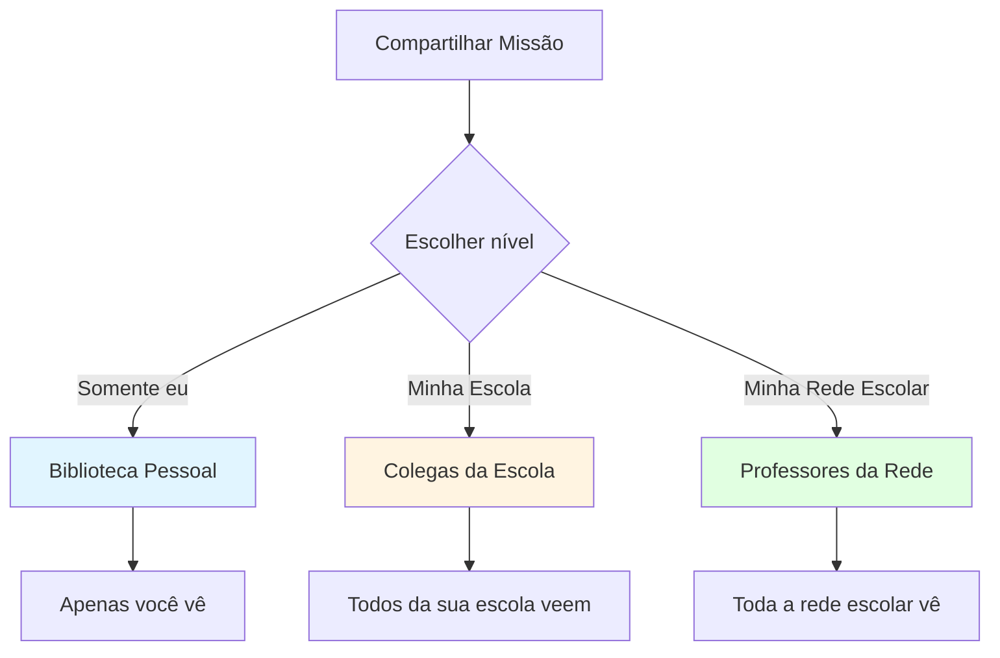
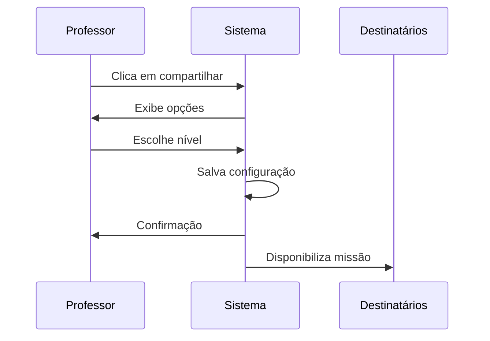

import { Meta } from '@storybook/blocks';

<Meta title="Funcionalidades/Missões/Compartilhar Missões" />

# Como Compartilhar Missões

## Visão Geral

O compartilhamento de missões permite que professores **reutilizem e compartilhem** missões criadas, facilitando a colaboração entre educadores e otimizando o tempo de preparação de atividades.

**Pré-requisito**: Você deve ser o **criador** da missão para poder compartilhá-la.

---

## Quando Compartilhar?

### ✅ Compartilhe quando:

- Criou uma missão particularmente efetiva
- Quer reutilizar a mesma missão em outro momento
- Deseja colaborar com colegas da sua escola
- Quer contribuir com a comunidade de professores da rede

### ❌ Não é necessário compartilhar quando:

- Missão é específica demais para sua turma
- Ainda está experimentando o formato
- Contém referências muito particulares

---

## Níveis de Compartilhamento

Existem **3 níveis** de compartilhamento de missões:

### Interface de Compartilhamento

  Figura 1: Botão "Compartilhar" na lista de missões

  Figura 2: Opções de níveis de compartilhamento

---

### Diagrama Conceitual dos Níveis

### 1. 🔒 Somente Eu

**O que é**: Missão fica salva na sua biblioteca pessoal.

**Quem vê**: Apenas você.

**Quando usar**:
- Para reutilizar suas próprias missões
- Como "template" pessoal
- Para ter acesso rápido a missões bem-sucedidas
- Para reenviar missões expiradas

**Vantagens**:
- ✅ Organização pessoal
- ✅ Fácil de encontrar
- ✅ Sem ruído de missões de outros

**Recomendação**: **Use por padrão** para todas as suas missões. É mais fácil encontrá-las depois!

---

### 2. 🏫 Minha Escola

**O que é**: Missão fica disponível para todos os professores da sua escola.

**Quem vê**: Todos os professores cadastrados na mesma escola que você.

**Quando usar**:
- Coordenação solicitou alinhamento entre turmas
- Quer que professores do mesmo ano usem a mesma missão
- Colaboração entre professores de disciplinas relacionadas

**Vantagens**:
- ✅ Alinhamento pedagógico na escola
- ✅ Economia de tempo (professor cria, outros reutilizam)
- ✅ Padronização de conteúdo

**Exemplo**: Professor de Matemática do 5º ano cria missão de frações e compartilha com outros professores de 5º ano da escola.

---

### 3. 🌐 Minha Rede Escolar

**O que é**: Missão fica disponível para todos os professores da rede escolar.

**Quem vê**: Todos os professores de todas as escolas da mesma rede.

**Quando usar**:
- Missão alinhada com projeto da rede
- Quer contribuir com toda a comunidade
- Rede solicitou compartilhamento de boas práticas

**Vantagens**:
- ✅ Alcance máximo
- ✅ Contribuição para comunidade ampla
- ✅ Reconhecimento como educador colaborativo

**Exemplo**: Coordenador pedagógico cria missão sobre Semana do Meio Ambiente e compartilha com toda a rede.

---

## Como Compartilhar

### Passo a Passo

1. Acesse "Missões"
2. Localize a missão que deseja compartilhar
3. Na coluna "Ações", clique no **ícone de compartilhamento** (🔗)
4. Escolha o nível: "Somente eu", "Minha Escola" ou "Minha Rede Escolar"
5. Confirme o compartilhamento

### Restrições

**⚠️ Importante**: Você **só pode compartilhar missões que você criou**. Missões criadas por outros professores não podem ser compartilhadas por você, mesmo que você as tenha usado.

---

## Usando Missões Compartilhadas

### Como Acessar

1. Clique em "Missões"
2. Clique em "Nova Missão"
3. Selecione **"Missão Compartilhada"**
4. Filtre por nível:
   - "Somente eu": Suas missões pessoais
   - "Minha Escola": Missões de colegas da escola
   - "Minha Rede": Missões de toda a rede
5. Localize a missão desejada
6. Clique em "Usar Missão"

### Personalizando Missão Compartilhada

Ao usar missão de outro professor, você pode:
- ✅ Alterar destinatários (sua turma)
- ✅ Alterar datas de início e fim
- ✅ Alterar nome (recomendado para diferenciar)
- ❌ Não pode alterar jogos (use a missão como está)

---

## Gerenciamento de Missões Compartilhadas

### Ver Minhas Missões Compartilhadas

Missões que você compartilhou ficam marcadas com ícone especial na lista.

### Alterar Nível de Compartilhamento

1. Acesse a missão
2. Clique novamente no ícone de compartilhamento
3. Escolha novo nível
4. Confirme

**Exemplo**: Missão que era "Somente eu" pode virar "Minha Escola"

### Parar de Compartilhar

Não há opção de "parar de compartilhar", mas você pode:
- Mudar para "Somente eu" (torna privada)
- Excluir a missão (se não foi enviada)

---

## Cenários de Uso

### Cenário 1: Biblioteca Pessoal

**Professor cria várias missões durante o ano e quer organizá-las para reutilizar.**

**Ação**: 
- Compartilhar todas com "Somente eu"
- Nomear claramente (ex: "Tabuada 3 - Semana 10")
- Quando precisar, acessar "Missões Compartilhadas" → "Somente eu"
- Usar missão novamente com nova turma/datas

### Cenário 2: Colaboração na Escola

**Coordenador quer que todos os professores do 3º ano usem mesma sequência de missões de Português.**

**Ação**:
- Coordenador cria missões
- Compartilha com "Minha Escola"
- Professores acessam "Missões Compartilhadas" → "Minha Escola"
- Cada um usa com sua turma, ajustando datas

### Cenário 3: Projeto de Rede

**Rede escolar tem projeto sobre Sustentabilidade e quer missões padronizadas.**

**Ação**:
- Equipe pedagógica cria missões temáticas
- Compartilha com "Minha Rede Escolar"
- Todos os professores da rede acessam
- Aplicam em suas respectivas escolas

---

## Boas Práticas

### ✅ Recomendações

1. **Use "Somente eu" como padrão**: Mais fácil de encontrar suas missões
2. **Nomeie claramente**: Facilitamesmo depois de meses
3. **Compartilhe as melhores**: Só compartilhe missões testadas e aprovadas
4. **Documente contexto**: Ao compartilhar na escola/rede, explique objetivo e público-alvo
5. **Agradeça colegas**: Se usar missão de colega, dê feedback positivo

### ⚠️ Evite

1. **Compartilhar tudo**: Seja seletivo, compartilhe qualidade não quantidade
2. **Missões muito específicas**: Não compartilhe missões muito particulares
3. **Sem testar**: Não compartilhe missão que você mesmo não testou

---

## Comparação: Compartilhar vs Reenviar

| Aspecto | Compartilhar | Reenviar |
|---------|--------------|----------|
| **Objetivo** | Reutilizar em outro momento | Dar segunda chance aos alunos |
| **Destinatários** | Mesmos ou diferentes | Mesmos alunos |
| **Quando usar** | Missão funcionou bem | Missão expirou |
| **Pode editar** | Sim (datas, turma) | Sim (datas) |
| **Cria nova missão** | Sim | Sim |

[Ver como reenviar missão expirada →](../?path=/docs/funcionalidades-missões-reenviar-expirada--docs)

---

## Troubleshooting

### Problema: Não consigo compartilhar missão

**Causas possíveis**:
1. Você não é o criador da missão
2. Missão foi criada por outro professor e você apenas a usou

**Solução**: Só é possível compartilhar missões que **você criou**.

### Problema: Não encontro minhas missões compartilhadas

**Solução**:
1. Acesse "Missões" → "Nova Missão"
2. Clique em "Missão Compartilhada"
3. Filtre por "Somente eu"
4. Todas as suas missões compartilhadas aparecerão

### Problema: Colega não vê missão que compartilhei

**Verificações**:
1. Você compartilhou no nível correto (Escola/Rede)?
2. Colega está cadastrado na mesma escola/rede?
3. Sistema pode levar alguns minutos para atualizar

---

## Referências

- [Como criar Missão Personalizada](../?path=/docs/funcionalidades-missões-criar-missão-personalizada--docs)
- [Como reenviar Missão expirada](../?path=/docs/funcionalidades-missões-reenviar-expirada--docs)
- [Tipos de Missão](../?path=/docs/funcionalidades-missões-visão-geral--docs)

---

**Fonte**: [Suporte Educacross - Compartilhar Missões](https://suporte.educacross.com.br/pt/category/missoes/article/compartilhar-missoes)  
**Última atualização**: 14 de janeiro de 2026
