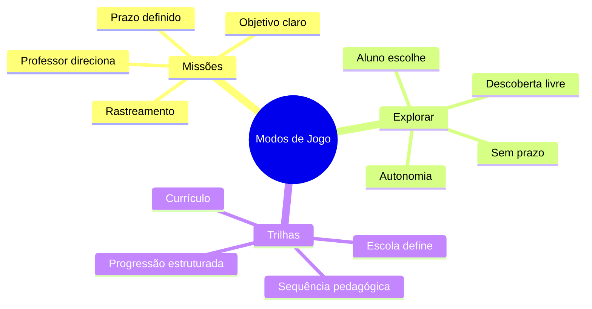
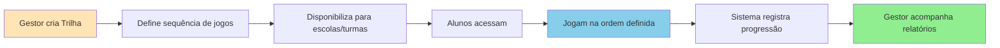
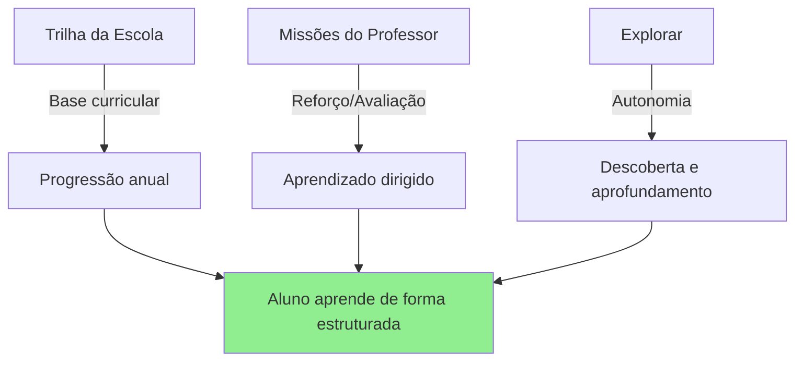

import { Meta } from '@storybook/blocks';

<Meta title="Funcionalidades/Missões/Missões, Explorar e Trilhas" />

# Missões, Explorar e Trilhas: Os 3 Modos de Jogo

## Visão Geral

A plataforma Educacross oferece **três formas diferentes** de os alunos interagirem com os jogos educativos. Cada modo tem objetivos pedagógicos específicos e atende a diferentes necessidades de aprendizagem.

---

## Comparação Rápida

| Aspecto | Missões | Explorar | Trilhas |
|---------|---------|----------|---------|
| **Quem define** | Professor | Aluno | Escola/Rede |
| **Estrutura** | Conjunto de jogos | Catálogo livre | Sequência planejada |
| **Prazo** | Sim (definido) | Não | Depende da configuração |
| **Objetivo** | Específico | Exploração | Progressão curricular |
| **Rastreamento** | Completo | Limitado | Completo |
| **Ideal para** | Atividades dirigidas | Autonomia e descoberta | Currículo estruturado |

---

## 🎯 Missões

### O Que São?

**Missões** são conjuntos de jogos **criados pelo professor** para atingir objetivos pedagógicos específicos.

### Características

- 👨‍🏫 **Professor cria**: Define jogos, ordem, prazo
- 📅 **Prazo definido**: Data de início e fim
- 🎯 **Objetivo claro**: Reforço, avaliação, introdução de conceito
- 📊 **Rastreamento total**: Professor vê quem fez, quanto tempo levou, acertos/erros
- 🏆 **Ranking opcional**: Pode ter ou não competição

### Quando Usar

| Situação | Exemplo |
|----------|---------|
| **Reforço de conteúdo** | Missão de tabuada após aula expositiva |
| **Avaliação formativa** | Missão com jogos de frações para verificar aprendizado |
| **Dever de casa** | Missão de leitura para fazer em casa |
| **Preparação para prova** | Missão de revisão antes da avaliação |
| **Projeto temático** | Missão sobre Meio Ambiente na Semana da Natureza |

### Vantagens

- ✅ **Controle pedagógico**: Professor direciona aprendizado
- ✅ **Foco**: Aluno sabe exatamente o que fazer
- ✅ **Dados**: Professor tem visão completa do desempenho
- ✅ **Motivação**: Prazo e objetivo geram senso de propósito

[Saiba mais sobre como criar Missões →](../?path=/docs/funcionalidades-missões-criar-missão-personalizada--docs)

---

## 🧭 Explorar

### O Que É?

**Explorar** é um modo onde o aluno **navega livremente** pelo catálogo de jogos, **sem direcionamento** do professor.

### Características

- 🧒 **Aluno escolhe**: Total autonomia na seleção de jogos
- 🆓 **Sem prazo**: Joga quando e quanto quiser
- 🔍 **Descoberta**: Pode encontrar jogos novos e inesperados
- 📈 **Aprendizado autônomo**: Desenvolve autogestão
- ⭐ **Menos rastreamento**: Professor vê apenas que aluno jogou, não tem relatórios detalhados

### Quando Usar

| Situação | Exemplo |
|----------|---------|
| **Tempo livre** | Aluno terminou atividade antes dos colegas |
| **Autonomia** | Desenvolver habilidade de escolha |
| **Interesse pessoal** | Aluno quer aprofundar em tema que gosta |
| **Descompressão** | Intervalo entre atividades dirigidas |
| **Descoberta de talentos** | Aluno pode descobrir áreas de interesse |

### Vantagens

- ✅ **Autonomia**: Aluno protagonista da própria aprendizagem
- ✅ **Motivação intrínseca**: Escolhe o que gosta, joga por prazer
- ✅ **Flexibilidade**: Sem pressão de prazo ou objetivo
- ✅ **Descoberta**: Pode encontrar conteúdos além do currículo formal

### Desvantagens

- ⚠️ **Menos controle**: Professor não direciona
- ⚠️ **Risco de dispersão**: Aluno pode não focar em necessidades reais
- ⚠️ **Rastreamento limitado**: Menos dados para o professor

### Como Aluno Acessa

1. Aluno faz login na plataforma
2. Clica na aba **"Explorar"**
3. Navega pelo catálogo de jogos
4. Filtra por:
   - Disciplina (Matemática, Português, etc.)
   - Ano escolar
   - Habilidade
   - Tema
5. Clica em jogo de interesse e começa a jogar

---

## 🛤️ Trilhas

### O Que São?

**Trilhas** são **sequências estruturadas de jogos** criadas pela **escola ou rede escolar** para seguir um **planejamento curricular**.

**💡 Nota**: Trilhas são criadas pelo **coordenador pedagógico ou gestor da rede**, não pelo professor individual.

### Características

- 🏫 **Escola/Rede define**: Alinhamento institucional
- 📚 **Sequência pedagógica**: Ordem dos jogos importa (progressão)
- 🎯 **Currículo estruturado**: Segue BNCC ou currículo local
- 📊 **Rastreamento institucional**: Gestores veem progresso geral
- 🔒 **Desbloqueio progressivo**: Pode exigir completar etapa anterior

### Quando Usar

| Situação | Exemplo |
|----------|---------|
| **Currículo anual** | Trilha de Matemática do 3º ano com jogos distribuídos por bimestre |
| **Projeto de rede** | Trilha de Alfabetização para todas escolas da rede |
| **Progressão estruturada** | Trilha de Inglês com 4 níveis (básico → avançado) |
| **Preparação padronizada** | Trilha para SAEB com habilidades essenciais |
| **Complemento ao livro** | Trilha seguindo capítulos do livro didático |

### Vantagens

- ✅ **Alinhamento curricular**: Todos os alunos seguem mesmo caminho
- ✅ **Progressão clara**: Aluno sabe onde está e para onde vai
- ✅ **Padronização**: Todas as turmas/escolas usam mesmo conteúdo
- ✅ **Visão macro**: Gestores acompanham progressão institucional
- ✅ **Menos trabalho para professor**: Currículo já está pronto

### Como Funciona

### Exemplo de Trilha

**Trilha: Frações - 4º Ano**

1. **Módulo 1: Introdução**
   - Jogo: O que é fração?
   - Jogo: Dividir pizza em partes iguais
   - Jogo: Identificar frações simples (1/2, 1/4)

2. **Módulo 2: Comparação**
   - Jogo: Qual fração é maior?
   - Jogo: Ordenar frações
   - Jogo: Frações equivalentes

3. **Módulo 3: Operações**
   - Jogo: Somar frações com mesmo denominador
   - Jogo: Subtrair frações simples
   - Jogo: Desafios de frações

---

## Combinação dos 3 Modos

### Uso Integrado

**Estratégia recomendada**: Usar os três modos de forma complementar.

**Exemplo de semana típica**:
- **Segunda a Quinta**: Aluno segue Trilha curricular (3 jogos por dia)
- **Sexta**: Professor envia Missão de revisão semanal (5 jogos específicos)
- **Final de semana**: Aluno explora livremente jogos que interessam

---

## Comparação Pedagógica

### Objetivos de Aprendizagem

| Objetivo | Missões | Explorar | Trilhas |
|----------|---------|----------|---------|
| **Cumprir currículo** | ⭐⭐ | ⭐ | ✅✅✅ |
| **Reforço específico** | ✅✅✅ | ⭐ | ⭐⭐ |
| **Autonomia do aluno** | ⭐ | ✅✅✅ | ⭐⭐ |
| **Descoberta** | ⭐ | ✅✅✅ | ⭐ |
| **Rastreamento detalhado** | ✅✅✅ | ⭐ | ✅✅✅ |
| **Flexibilidade** | ⭐⭐ | ✅✅✅ | ⭐ |

---

## Cenários de Uso

### Cenário 1: Escola Estruturada

**Configuração**:
- Trilha curricular obrigatória (60% do uso)
- Missões semanais dos professores (30%)
- Explorar livre nos intervalos (10%)

**Vantagens**: Alinhamento total com currículo, mas com espaço para reforço e autonomia.

---

### Cenário 2: Pedagogia Ativa

**Configuração**:
- Explorar como principal (50%)
- Missões temáticas do professor (30%)
- Trilhas opcionais (20%)

**Vantagens**: Aluno protagonista, professor como facilitador.

---

### Cenário 3: Ensino Híbrido

**Configuração**:
- Trilha em sala de aula (40%)
- Missões para casa (40%)
- Explorar em tempo livre (20%)

**Vantagens**: Combina estrutura presencial com flexibilidade remota.

---

## Boas Práticas

### ✅ Recomendações

1. **Combine os 3 modos**: Cada um tem seu valor pedagógico
2. **Trilhas como base**: Use para garantir currículo mínimo
3. **Missões para ajustes**: Reforce pontos fracos detectados
4. **Explorar como prêmio**: Incentive autonomia sem pressão
5. **Comunique claramente**: Alunos devem entender diferença entre os modos

### ⚠️ Evite

1. **Usar apenas um modo**: Perde riqueza pedagógica
2. **Explorar sem supervisão**: Acompanhe minimamente o que alunos fazem
3. **Trilhas rígidas demais**: Permita alguma flexibilidade
4. **Missões excessivas**: Não sobrecarregue com muitas missões simultâneas

---

## Acesso pelos Alunos

### Interface do Aluno

Após login, aluno vê 3 abas principais:

1. **Missões**: Lista de missões enviadas pelo professor
2. **Explorar**: Catálogo completo de jogos
3. **Trilhas**: Trilhas disponibilizadas pela escola (se configurado)

### Orientação para Alunos

**Quando usar cada aba**:

- **Missões**: Tem prazo! Priorize fazer primeiro.
- **Explorar**: Tempo livre? Explore à vontade!
- **Trilhas**: Quer seguir caminho completo? Siga a trilha.

---

## Troubleshooting

### Problema: Aluno só joga Explorar, não faz Missões

**Causa**: Falta clareza sobre prioridade.

**Solução**:
- Explique que Missões têm prazo e são obrigatórias
- Explorar é para tempo livre
- Considere gamificação (Missões dão mais pontos/medalhas)

### Problema: Aluno não entende diferença

**Solução**: Use analogia clara:
- **Missões** = Dever de casa (professor manda)
- **Explorar** = Recreio (você escolhe)
- **Trilhas** = Matérias do ano (currículo da escola)

### Problema: Professor não vê dados de Explorar

**Causa**: Sistema não rastreia detalhadamente jogos livres.

**Esclarecimento**: Proposital. Explorar é sobre autonomia, menos sobre controle.

---

## Referências

- [Como criar Missão Personalizada](../?path=/docs/funcionalidades-missões-criar-missão-personalizada--docs)
- [Tipos de Missão](../?path=/docs/funcionalidades-missões-visão-geral--docs)

---

**Fonte**: [Suporte Educacross - Missões, Explorar e Trilhas](https://suporte.educacross.com.br/pt/category/missoes/article/missoes-explorar-trilhas)  
**Última atualização**: 14 de janeiro de 2026
