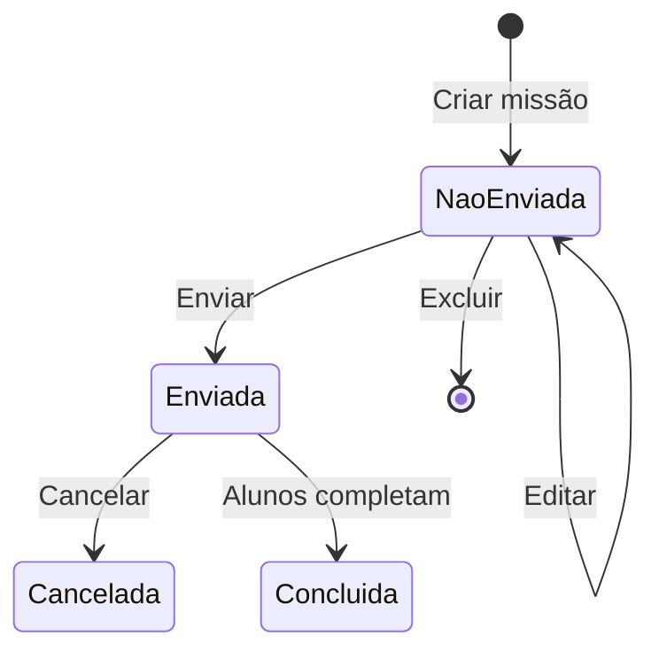
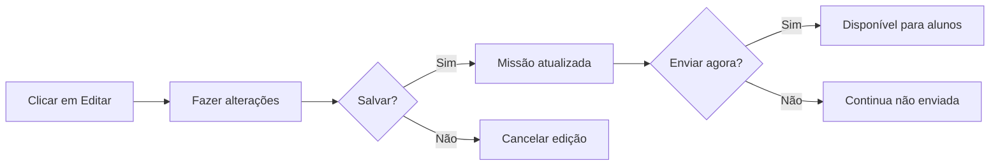
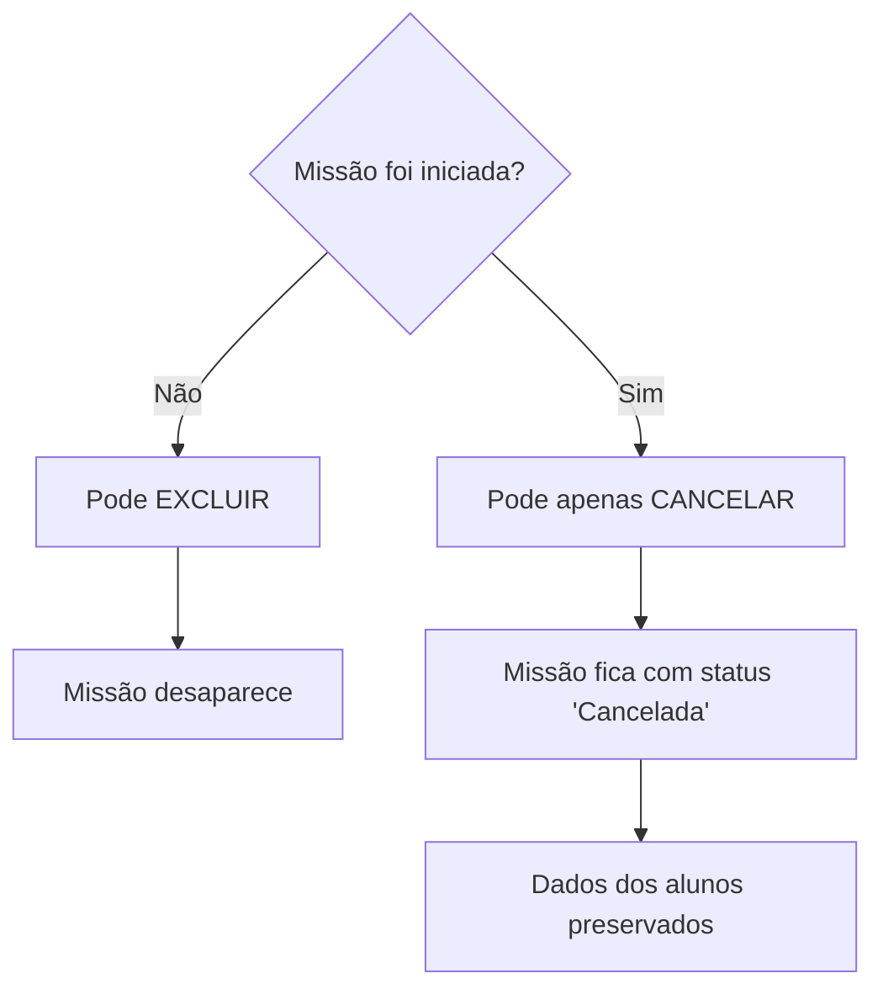

import { Meta } from '@storybook/blocks';

<Meta title="Funcionalidades/Missões/Gerenciar Missões" />

# Como Editar, Excluir, Enviar ou Cancelar Missões

## Visão Geral

Na lista "Missões", é possível observar todas as missões criadas, acompanhar a situação de cada uma delas, bem como editá-las, excluí-las e compartilhá-las.

**Importante**: As opções de edição, exclusão e envio estão disponíveis **apenas para missões que ainda não foram enviadas** aos alunos (status "Não enviada").

---

## Estados de uma Missão

---

## Ações Disponíveis

### Interface de Gerenciamento

  Figura 1: Coluna "Ações" com botões de gerenciamento

  Figura 2: Botão "Enviar"

  Figura 3: Interface de edição

  Figura 4: Confirmação de exclusão

  Figura 5: Botão "Cancelar Missão"

  Figura 6: Missão com status "Cancelada"

---

### 📤 Enviar

**Quando disponível**: Missão com status "Não enviada"

**O que faz**: Torna a missão disponível para todos os alunos selecionados no momento da criação.

**Resultado**:
- ✅ Missão aparece para os alunos
- ✅ Alunos recebem notificação
- ✅ Status muda para "Enviada"
- ❌ Não pode mais ser editada ou excluída

**Como fazer**: Clique no ícone de enviar (✉️) na coluna "Ações"

---

### ✏️ Editar

**Quando disponível**: Missão com status "Não enviada" ou "Não iniciada"

**O que pode editar**:
- Nome da missão
- Jogos incluídos (adicionar/remover)
- Ordem dos jogos (se sequencial)
- Destinatários
- Datas de início e fim
- Fluxo (livre/sequencial)
- Ranking (habilitar/desabilitar)

**O que NÃO pode editar**: Missões já iniciadas por pelo menos um aluno

**Como fazer**: Clique no ícone de editar (✏️) na coluna "Ações"

---

### 🗑️ Excluir

**Quando disponível**: Missão com status "Não enviada" ou "Não iniciada"

**O que faz**: Remove a missão **permanentemente** do sistema.

**Importante**: 
- ❌ Ação irreversível
- ❌ Não pode ser recuperada
- ❌ Só funciona se nenhum aluno começou a jogar

**Como fazer**: Clique no ícone de excluir (🗑️) na coluna "Ações"

**Confirmação**: Sistema pedirá confirmação antes de excluir.

**⚠️ Atenção**: Se você quer apenas "guardar" a missão para usar depois, ao invés de excluir, use a opção **Arquivar**.

---

### ❌ Cancelar

**Quando disponível**: Missão **já iniciada** por pelo menos um aluno

**O que faz**: Cancela a missão, mas **não a exclui** do sistema.

**Diferença entre Excluir e Cancelar**:

| Aspecto | Excluir | Cancelar |
|---------|---------|----------|
| **Quando usar** | Antes de enviar/iniciar | Depois de iniciada |
| **O que acontece** | Remove permanentemente | Mantém no histórico |
| **Dados de alunos** | N/A (ninguém jogou) | Preservados |
| **Reversível** | Não | Não |
| **Aparece na lista** | Não | Sim (status "Cancelada") |

**Por que preserva**: Para que alunos que já jogaram não percam seus dados e progresso.

**Como fazer**: Clique no ícone vermelho (❌) na coluna "Ações"

---

## Matriz de Permissões

| Ação | Não Enviada | Enviada (não iniciada) | Iniciada | Concluída | Expirada |
|------|-------------|------------------------|----------|-----------|----------|
| Enviar | ✅ | ❌ | ❌ | ❌ | ❌ |
| Editar | ✅ | ✅ | ❌ | ❌ | ❌ |
| Excluir | ✅ | ✅ | ❌ | ❌ | ❌ |
| Cancelar | ❌ | ✅ | ✅ | ❌ | ❌ |
| Arquivar | ✅ | ✅ | ✅ | ✅ | ✅ |
| Compartilhar | ✅ | ✅ | ✅ | ✅ | ✅ |

---

## Passo a Passo Ilustrado

### Enviar Missão

1. Acesse "Missões"
2. Localize missão com status "Não enviada"
3. Na coluna "Ações", clique no ícone de enviar (✉️)
4. Confirme o envio
5. Missão fica disponível para alunos

### Editar Missão

1. Acesse "Missões"
2. Localize missão "Não enviada"
3. Na coluna "Ações", clique no ícone de editar (✏️)
4. Faça as alterações necessárias
5. Clique em "Salvar"
6. Escolha "Enviar agora" ou "Enviar depois"

### Excluir Missão

1. Acesse "Missões"
2. Localize missão "Não enviada"
3. Na coluna "Ações", clique no ícone de excluir (🗑️)
4. **Confirme a exclusão** (ação irreversível)
5. Missão é removida da lista

### Cancelar Missão

1. Acesse "Missões"
2. Localize missão "Iniciada" ou "Enviada"
3. Na coluna "Ações", clique no X vermelho (❌)
4. Confirme o cancelamento
5. Missão muda para status "Cancelada"
6. Alunos não podem mais acessar, mas dados ficam preservados

---

## Casos de Uso Comuns

### Caso 1: Erro na Data

**Problema**: Configurou data de início errada.

**Solução**:
1. Se não foi enviada: Editar e corrigir data
2. Se já foi enviada mas não iniciada: Cancelar e criar nova
3. Se já iniciada: Cancelar e criar nova com datas corretas

### Caso 2: Jogos Errados

**Problema**: Incluiu jogos errados na missão.

**Solução**:
1. Se não foi enviada: Editar, remover jogos errados, adicionar corretos
2. Se já iniciada: Cancelar e criar missão correta

### Caso 3: Destinatários Errados

**Problema**: Enviou para turma errada.

**Solução**:
1. Cancelar missão enviada errado
2. Criar nova missão para turma correta
3. (Opcional) Explicar aos alunos da turma errada que foi engano

### Caso 4: Missão Duplicada

**Problema**: Criou missão duplicada por engano.

**Solução**:
1. Se não foi enviada: Excluir a duplicada
2. Se já foi enviada: Cancelar a duplicada

---

## Boas Práticas

### ✅ Recomendações

1. **Revise antes de enviar**: Sempre revise todos os detalhes antes de enviar
2. **Teste em rascunho**: Crie, revise, teste os jogos, só depois envie
3. **Comunique cancelamentos**: Se cancelar missão iniciada, avise os alunos
4. **Arquive ao invés de excluir**: Para manter histórico

### ⚠️ Evite

1. **Cancelar missões frequentemente**: Gera confusão nos alunos
2. **Editar missões enviadas**: Não é possível, planeje melhor
3. **Excluir missões importantes**: Use arquivar para manter registro

---

## Troubleshooting

### Problema: Não consigo editar missão enviada

**Causa**: Missão já foi iniciada por algum aluno.

**Solução**: 
- Cancele a missão atual
- Crie nova missão corrigida
- Avise os alunos sobre a mudança

### Problema: Não aparece opção de excluir

**Causa**: Missão já foi iniciada.

**Solução**: Use "Cancelar" ao invés de "Excluir"

### Problema: Aluno reclama que missão sumiu

**Causa**: Você cancelou a missão.

**Solução**:
- Explique que foi cancelada
- Crie nova missão se necessário
- Considere arquivar ao invés de cancelar no futuro

---

## Referências

- [Como criar Missão Personalizada](../?path=/docs/funcionalidades-missões-criar-missão-personalizada--docs)
- [Missões Arquivadas](../?path=/docs/funcionalidades-missões-arquivadas--docs)
- [Como compartilhar Missões](../?path=/docs/funcionalidades-missões-compartilhar--docs)

---

**Fonte**: [Suporte Educacross - Gerenciar Missões](https://suporte.educacross.com.br/pt/category/missoes/article/editar-excluir-enviar-cancelar-missoes)  
**Última atualização**: 14 de janeiro de 2026
