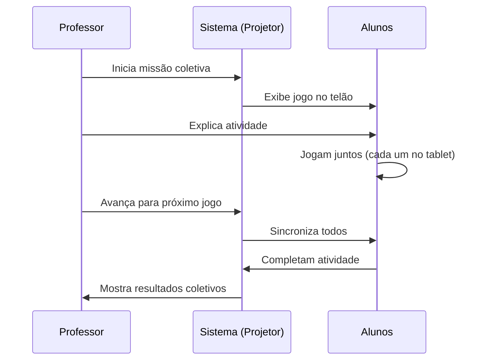
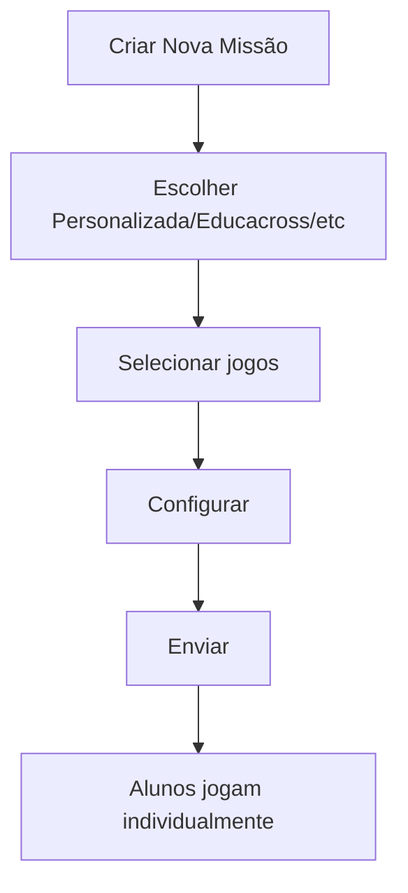
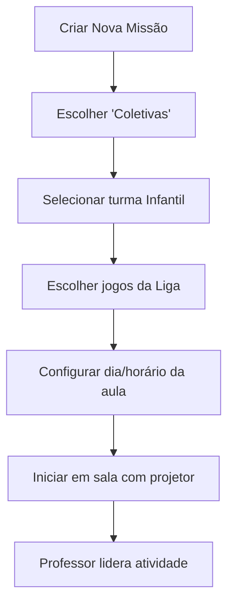

import { Meta } from '@storybook/blocks';

<Meta title="Funcionalidades/Missões/Individuais vs Coletivas" />

# Missões Individuais vs Missões Coletivas

## Visão Geral

A plataforma oferece **dois modos de execução** de missões: **Individual** e **Coletivo**. Cada modo atende a objetivos pedagógicos e faixas etárias diferentes.

**Importante**: O tipo "Coletivas" está disponível apenas para **Educação Infantil** através da **Liga das Corujinhas**.

---

## Comparação Rápida

### Interface dos Modos

  Figura 1: Comparação visual entre os dois modos de missão

---

### Tabela Comparativa

| Aspecto | Missões Individuais | Missões Coletivas |
|---------|---------------------|-------------------|
| **Disponível para** | Todos os níveis | Apenas Infantil |
| **Como funciona** | Aluno navega sozinho | Professor lidera turma |
| **Ritmo** | Próprio do aluno | Sincronizado (turma toda junta) |
| **Onde** | Qualquer lugar | Sala de aula presencial |
| **Dispositivos** | Individual (tablet/computador) | Projetor + dispositivos individuais |
| **Autonomia do aluno** | Alta | Baixa (professor conduz) |
| **Interação** | Aluno-sistema | Aluno-aluno-professor |
| **Ideal para** | Casa, sala de informática | Sala de aula coletiva |

---

## Missões Individuais

### O Que São?

Missões onde **cada aluno joga no seu próprio ritmo**, sem precisar estar sincronizado com colegas.

### Características

**Principais aspectos**:
- ✅ Aluno escolhe quando jogar
- ✅ Pode pausar e voltar depois
- ✅ Cada um no seu tempo
- ✅ Pode fazer em casa ou escola
- ✅ Flexibilidade total

### Quando Usar

| Situação | Por quê? |
|----------|----------|
| **Dever de casa** | Aluno faz no tempo dele |
| **Sala de informática** | Cada um em seu computador |
| **Reforço individualizado** | Ritmo próprio de cada aluno |
| **Ensino híbrido** | Parte em casa, parte na escola |
| **Autonomia** | Desenvolver independência |

### Níveis Recomendados

- ✅ **Fundamental I** (1º ao 5º ano)
- ✅ **Fundamental II** (6º ao 9º ano)
- ✅ **Ensino Médio**
- ⚠️ **Infantil** (com supervisão)

---

## Missões Coletivas (Liga das Corujinhas)

### O Que São?

Missões onde **toda a turma joga junto**, com o professor **liderando a atividade** através de projeção.

**📌 Exclusivo Educação Infantil**: Este modo foi desenvolvido especialmente para crianças pequenas que precisam de mediação constante do professor.

### Como Funciona

### Características

**Principais aspectos**:
- 👨‍🏫 **Professor comanda**: Ele quem decide quando avançar
- 📺 **Projeção obrigatória**: Jogo aparece no telão para todos verem
- 🔒 **Sincronização**: Turma toda no mesmo jogo ao mesmo tempo
- 🎯 **Mediação pedagógica**: Professor explica, orienta, tira dúvidas
- 🏆 **Resultados coletivos**: Foco no trabalho em equipe, não competição individual

### Setup Técnico

**Necessário**:
1. Projetor ou TV grande na sala
2. Tablet/computador para o professor (controle)
3. Tablet/computador individual para cada aluno (ou duplas)
4. Conexão com internet estável

**Configuração**:
1. Professor conecta dispositivo ao projetor
2. Inicia missão coletiva no modo "Professor"
3. Alunos conectam seus dispositivos na mesma missão
4. Sistema sincroniza automaticamente

---

## Diferenças Pedagógicas

### Objetivos de Aprendizagem

| Objetivo | Individual | Coletiva |
|----------|-----------|----------|
| **Autonomia** | ✅✅✅ Foco principal | ⭐ Secundário |
| **Colaboração** | ⭐ Limitada | ✅✅✅ Foco principal |
| **Ritmo próprio** | ✅✅✅ Total | ❌ Não aplicável |
| **Mediação docente** | ⭐ Opcional | ✅✅✅ Essencial |
| **Socialização** | ⭐ Indireta | ✅✅✅ Direta |

### Desenvolvimento de Competências

**Missões Individuais desenvolvem**:
- Autogestão
- Persistência
- Concentração individual
- Responsabilidade pessoal

**Missões Coletivas desenvolvem**:
- Trabalho em equipe
- Escuta ativa
- Seguir instruções coletivas
- Paciência e espera

---

## Fluxo de Criação

### Individual

### Coletiva (Liga das Corujinhas)

---

## Exemplos Práticos

### Exemplo 1: Missão Individual

**Contexto**: 3º ano, atividade de tabuada

**Como funciona**:
1. Professor cria missão com 5 jogos de multiplicação
2. Define prazo: 1 semana
3. Envia para turma
4. Cada aluno faz em casa ou na sala de informática
5. Maria termina em 2 dias, João em 5 dias
6. Ambos no próprio ritmo

**Vantagem**: Respeita tempo de cada um.

---

### Exemplo 2: Missão Coletiva

**Contexto**: Infantil 5, reconhecimento de cores

**Como funciona**:
1. Professora cria missão Liga das Corujinhas com jogos de cores
2. Na sala, conecta tablet ao projetor
3. Inicia missão: jogo aparece no telão
4. Explica: "Vamos encontrar objetos azuis!"
5. Crianças jogam em seus tablets
6. Todos veem no telão quem está acertando
7. Professora avança para próximo jogo quando turma toda termina
8. Comemoração coletiva ao finalizar missão

**Vantagem**: Engajamento coletivo, mediação constante.

---

## Quando Usar Cada Modo?

### Use Missões Individuais quando:

- ✅ Alunos têm níveis muito diferentes (cada um precisa de ritmo próprio)
- ✅ Objetivo é desenvolver autonomia
- ✅ Não há possibilidade de reunir todos ao mesmo tempo
- ✅ Atividade é para casa
- ✅ Quer permitir tentativas múltiplas sem pressão

### Use Missões Coletivas quando:

- ✅ Turma é Educação Infantil
- ✅ Objetivo é trabalho em equipe
- ✅ Quer mediar em tempo real
- ✅ Precisa garantir que todos façam junto
- ✅ Atividade exige explicação constante
- ✅ Quer promover interação social

---

## Boas Práticas

### Missões Individuais

**✅ Faça**:
1. Defina prazos realistas (pelo menos 3-5 dias)
2. Ofereça variedade de dificuldade nos jogos
3. Acompanhe relatórios para identificar dificuldades
4. Permita que alunos refaçam se errarem

**⚠️ Evite**:
1. Prazos muito curtos (gera ansiedade)
2. Missões longas demais (aluno desanima)
3. Ignorar alunos que não completam

---

### Missões Coletivas

**✅ Faça**:
1. Teste a conexão e projeção antes da aula
2. Explique regras antes de começar
3. Dê tempo para todos terminarem cada jogo
4. Comemore conquistas coletivas
5. Mantenha ambiente lúdico e sem pressão

**⚠️ Evite**:
1. Apressar alunos que são mais lentos
2. Competição excessiva (foco é colaboração)
3. Sessões muito longas (máximo 30-40 min para Infantil)
4. Frustrar quem erra (reforce o positivo)

---

## Troubleshooting

### Problema: Aluno Infantil não consegue fazer missão individual

**Causa**: Criança pequena precisa de supervisão/mediação.

**Solução**: 
- Use missões coletivas na escola
- Se for individual, oriente responsável a acompanhar em casa
- Considere se o nível de dificuldade é adequado para a idade

### Problema: Missões coletivas dessincronizam

**Causa**: Problemas de conexão.

**Solução**:
- Verifique estabilidade da internet
- Reinicie a sessão se necessário
- Reduza número de dispositivos conectados
- Use apenas tablets com boa conexão

### Problema: Alunos terminam em tempos muito diferentes

**Causa**: Níveis de habilidade muito diferentes.

**Situação Individual**: Normal e esperado. Cada um no seu ritmo.  
**Situação Coletiva**: Desafiador. Considere atividades extras para quem termina antes (colorir, desenhar relacionado ao tema).

---

## Referências

- [Tipos de Missão](../?path=/docs/funcionalidades-missões-visão-geral--docs)
- [Como criar Missão Personalizada](../?path=/docs/funcionalidades-missões-criar-missão-personalizada--docs)
- [Liga das Corujinhas (Coletivas)](../?path=/docs/funcionalidades-missões-visão-geral--docs#liga-das-corujinhas-coletivas)

---

**Fonte**: [Suporte Educacross - Individuais vs Coletivas](https://suporte.educacross.com.br/pt/category/missoes/article/missoes-individuais-missoes-coletivas)  
**Última atualização**: 14 de janeiro de 2026
