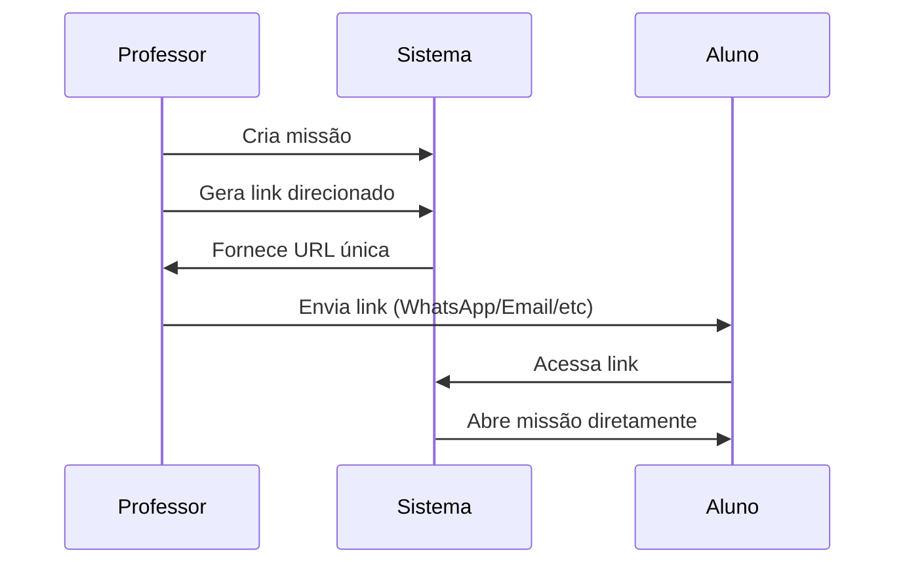
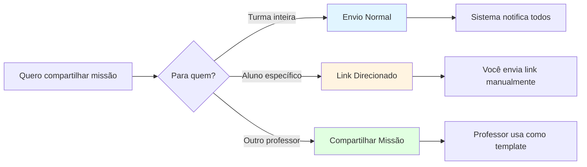

import { Meta } from '@storybook/blocks';

<Meta title="Funcionalidades/Missões/Link Direcionado" />

# Compartilhar Missões via Link Direcionado

## Visão Geral

O **Link Direcionado** permite que professores compartilhem missões diretamente com alunos através de um link, sem precisar enviá-la formalmente pelo sistema.

**Ideal para**: Alunos de outra turma, aulas extras, reforço individualizado, ou atividades opcionais.

---

## Para Que Serve?

### Casos de Uso

| Cenário | Exemplo |
|---------|---------|
| **Aluno de outra turma** | Professor quer dar missão extra para aluno específico que não está na sua turma |
| **Reforço individualizado** | Aluno precisa de atividade adicional fora da missão da turma |
| **Atividades opcionais** | Missão de desafio para alunos avançados |
| **Compartilhamento externo** | Enviar missão para pais acompanharem em casa |

---

## Como Funciona

### Interface do Link Direcionado

  Figura 1: Opção para gerar link direcionado

  Figura 2: Link gerado pronto para compartilhar

---

### Diagrama do Fluxo

---

## Passo a Passo

### 1. Criar ou Selecionar Missão

- **Opção A**: Crie nova missão personalizada
- **Opção B**: Selecione missão existente (enviada ou não)

### 2. Gerar Link

1. Na lista de "Missões", localize a missão
2. Na coluna "Ações", clique no **ícone de link** (🔗)
3. Sistema gera URL único automaticamente
4. Copie o link exibido

### 3. Compartilhar

Você pode compartilhar o link por:
- 📱 WhatsApp
- 📧 Email
- 💬 Mensagem no próprio sistema
- 📋 Copiar e colar em qualquer lugar

### 4. Aluno Acessa

1. Aluno recebe o link
2. Clica no link
3. Faz login (se necessário)
4. Missão abre automaticamente
5. Aluno pode começar a jogar

---

## Diferenças: Envio Normal vs Link Direcionado

| Aspecto | Envio Normal | Link Direcionado |
|---------|--------------|------------------|
| **Destinatários** | Turma/Grupo pré-definido | Qualquer pessoa com o link |
| **Controle** | Apenas alunos selecionados | Qualquer um que tenha o link |
| **Notificação** | Sim (sistema notifica) | Não (responsabilidade do professor) |
| **Rastreamento** | Aparece para todos da turma | Individual por link |
| **Flexibilidade** | Menos flexível | Muito flexível |
| **Segurança** | Mais controlado | Menos controlado |

---

## Vantagens

### ✅ Para o Professor

1. **Flexibilidade total**: Enviar para quem quiser, quando quiser
2. **Sem burocracia**: Não precisa adicionar aluno em turma/grupo
3. **Atividades extras**: Fácil dar reforço ou desafios
4. **Múltiplos canais**: Usar qualquer meio de comunicação

### ✅ Para o Aluno

1. **Acesso direto**: Um clique e já está na missão
2. **Simples**: Não precisa buscar na lista de missões
3. **Rápido**: Sem navegação complexa

---

## Restrições

### ⚠️ Importante

1. **Qualquer pessoa com o link pode acessar**: Não compartilhe publicamente se quiser restringir
2. **Link não expira**: Funciona indefinidamente enquanto missão existir
3. **Não substitui envio formal**: Para turmas inteiras, use envio normal
4. **Aluno precisa estar logado**: Se não tiver conta, precisará criar antes

---

## Cenários de Uso

### Cenário 1: Reforço Individualizado

**Situação**: Aluno precisa revisar conteúdo específico.

**Ação**:
1. Professor cria missão focada no conteúdo
2. Gera link direcionado
3. Envia via WhatsApp para responsável
4. Aluno faz em casa

**Vantagem**: Não precisa enviar para turma toda.

---

### Cenário 2: Aluno de Outra Turma

**Situação**: Aluno do 5º A precisa fazer atividade do 5º B.

**Ação**:
1. Professor do 5º B gera link da missão da turma dele
2. Envia link para professor do 5º A
3. Professor repassa para aluno específico
4. Aluno acessa e joga

**Vantagem**: Sem precisar matricular aluno em outra turma.

---

### Cenário 3: Desafio Opcional

**Situação**: Professor quer oferecer atividade extra para alunos avançados.

**Ação**:
1. Cria missão desafio
2. Gera link
3. Anuncia na sala: "Quem quiser fazer atividade extra, aqui está o link"
4. Alunos interessados acessam
5. Outros ignoram

**Vantagem**: Não obriga ninguém, mas oferece oportunidade.

---

### Cenário 4: Atividade para Família

**Situação**: Professor quer que pais acompanhem atividade.

**Ação**:
1. Cria missão com jogos educativos
2. Gera link
3. Envia para responsáveis com orientações
4. Pais jogam junto com criança em casa

**Vantagem**: Engajamento familiar.

---

## Segurança e Privacidade

### Boas Práticas

1. **Compartilhe com cuidado**: Envie apenas para destinatários específicos
2. **Não publique em redes sociais**: Links podem ser acessados por qualquer um
3. **Use canais seguros**: WhatsApp direto, email pessoal, sistema da escola
4. **Avise sobre validade**: Deixe claro até quando missão estará disponível

### Riscos a Evitar

- ❌ Postar link em grupo público
- ❌ Deixar link em lugar visível para todos
- ❌ Não explicar que é pessoal/limitado

---

## Comparação com Outras Formas de Compartilhamento

### Quando Usar Cada Um

| Objetivo | Método | Por quê? |
|----------|--------|----------|
| Turma toda precisa fazer | **Envio Normal** | Controle, rastreamento automático |
| Um aluno específico | **Link Direcionado** | Flexibilidade, sem burocracia |
| Colega quer reutilizar | **Compartilhar Missão** | Colaboração entre professores |

---

## Monitoramento

### Como Saber Quem Acessou?

Quando aluno acessa via link direcionado:
- ✅ Você vê o progresso dele na aba "Missões"
- ✅ Aparece no relatório de desempenho
- ✅ Sistema registra todas as interações

**Porém**: Você não vê quem **recebeu** o link (apenas quem **acessou**).

---

## Troubleshooting

### Problema: Link não abre

**Causas possíveis**:
1. Missão foi excluída ou cancelada
2. Link foi copiado incorretamente (quebrado)
3. Aluno não está logado

**Solução**:
- Verifique se missão ainda existe
- Gere novo link e envie novamente
- Oriente aluno a fazer login antes de clicar

### Problema: Aluno não consegue acessar

**Causas possíveis**:
1. Aluno não tem conta no sistema
2. Link expirou (se missão tinha data limite)
3. Problema técnico

**Solução**:
- Verifique se aluno está cadastrado
- Confirme se missão ainda está ativa
- Gere novo link

### Problema: Muitas pessoas acessaram

**Causa**: Link foi compartilhado além do previsto.

**Solução**:
- Cancele a missão (se necessário)
- Crie nova missão com link diferente
- Seja mais cuidadoso ao compartilhar

---

## Referências

- [Como compartilhar Missões](../?path=/docs/funcionalidades-missões-compartilhar--docs)
- [Como criar Missão Personalizada](../?path=/docs/funcionalidades-missões-criar-missão-personalizada--docs)
- [Tipos de Missão](../?path=/docs/funcionalidades-missões-visão-geral--docs)

---

**Fonte**: [Suporte Educacross - Link Direcionado](https://suporte.educacross.com.br/pt/category/missoes/article/compartilhar-missoes-atraves-de-link)  
**Última atualização**: 14 de janeiro de 2026
