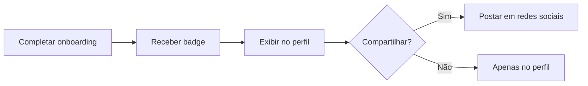

import { Meta } from '@storybook/addon-docs/blocks';
import { MermaidDiagram } from '../../src/components/MermaidDiagram';

<Meta title="Jornadas/Onboarding/Primeiro Acesso" />

# Jornada de Onboarding: Primeiro Acesso

## Visão Geral

Esta jornada descreve a experiência de um novo usuário (qualquer papel) no primeiro acesso à plataforma, desde a criação da conta até o domínio das funcionalidades básicas.

**Objetivo**: Usuário consegue realizar suas tarefas principais sem ajuda externa.

**Duração média**: 10 minutos

**Taxa de conclusão esperada**: 90%

---

## Fluxo Principal

<MermaidDiagram chart={`
flowchart TD
    A[Primeiro acesso pós-cadastro] --> B{Email confirmado?}
    B -->|Não| C[Solicitar confirmação]
    C --> D[Aguardar confirmação]
    D --> B
    B -->|Sim| E[Login bem-sucedido]
    E --> F{Papel do usuário?}
    F -->|Aluno| G[Onboarding de aluno]
    F -->|Professor| H[Onboarding de professor]
    F -->|Coordenador| I[Onboarding de coordenador]
    F -->|Admin| J[Onboarding de admin]
    
    G --> K[Tour: Dashboard aluno]
    K --> L[Tour: Como acessar curso]
    L --> M[Tour: Como ver materiais]
    M --> N[Tour: Como enviar atividade]
    N --> O[Tour: Como ver notas]
    
    H --> P[Tour: Dashboard professor]
    P --> Q[Tour: Como criar conteúdo]
    Q --> R[Tour: Como lançar notas]
    R --> S[Tour: Como ver turmas]
    
    I --> T[Tour: Dashboard coordenador]
    T --> U[Tour: Como aprovar conteúdo]
    U --> V[Tour: Como ver relatórios]
    
    J --> W[Tour: Painel admin]
    W --> X[Tour: Gestão de usuários]
    X --> Y[Tour: Configurações]
    
    O --> Z{Completou tour?}
    S --> Z
    V --> Z
    Y --> Z
    
    Z -->|Sim| AA[Marcar onboarding concluído]
    Z -->|Não| AB[Salvar progresso]
    AA --> AC[Redirecionar para ação sugerida]
    AB --> AC
    AC --> AD[Fim]
`} />

---

## Estrutura do Tour Interativo

### Características Gerais

<MermaidDiagram chart={`
flowchart LR
    A[Iniciar tour] --> B[Destacar elemento]
    B --> C[Exibir tooltip explicativo]
    C --> D[Botão 'Próximo']
    D --> E{Última etapa?}
    E -->|Não| F[Próximo elemento]
    F --> B
    E -->|Sim| G[Botão 'Concluir']
    G --> H[Salvar progresso]
    H --> I[Exibir badge de conclusão]
`} />

**Elementos do tooltip**:
- Título da etapa
- Descrição clara (máximo 80 caracteres)
- Indicador de progresso (ex: "3/7")
- Botões: "Anterior", "Próximo", "Pular tour"
- Imagem ou GIF demonstrativo (opcional)

**Regras de UX**:
- Fundo escurecido (overlay 60% opacidade)
- Elemento destacado com spotlight
- Setas apontando para elemento relevante
- Tour pode ser pulado a qualquer momento
- Progresso é salvo automaticamente
- Tour pode ser retomado posteriormente

---

## Onboarding por Papel

### 🔵 Onboarding de Aluno (7 etapas)

**Objetivo**: Aluno consegue acessar materiais e fazer atividades.

**Etapas**:

1. **Bem-vindo ao Educacross**
   - Mensagem de boas-vindas
   - Explicação sobre a plataforma
   - Destaque do suporte disponível

2. **Seu Dashboard**
   - Visão geral do dashboard
   - Onde ver cursos matriculados
   - Indicador de progresso

3. **Como Acessar um Curso**
   - Clicar no card do curso
   - Visualizar módulos
   - Navegar entre aulas

4. **Materiais Didáticos**
   - Como baixar PDFs
   - Como assistir vídeos
   - Como abrir links externos

5. **Atividades e Avaliações**
   - Onde ver atividades pendentes
   - Como enviar trabalho
   - Como fazer prova online

6. **Acompanhamento de Desempenho**
   - Como ver notas
   - Como ver frequência
   - Como entender indicadores

7. **Precisa de Ajuda?**
   - Como acessar FAQ
   - Como contatar suporte
   - Como reportar problemas

**Ação sugerida ao final**: Acessar primeira aula do curso

**Tempo médio**: 5 minutos

---

### 🟢 Onboarding de Professor (8 etapas)

**Objetivo**: Professor consegue publicar conteúdo e avaliar alunos.

**Etapas**:

1. **Bem-vindo, Professor**
   - Mensagem institucional
   - Visão geral das funcionalidades
   - Acesso a material de apoio pedagógico

2. **Seu Dashboard Docente**
   - Turmas ativas
   - Atividades pendentes
   - Calendário de aulas

3. **Como Gerenciar sua Turma**
   - Acessar lista de alunos
   - Ver desempenho da turma
   - Identificar alunos em risco

4. **Como Adicionar Conteúdo**
   - Fazer upload de material
   - Preencher metadados
   - Agendar publicação

5. **Como Criar Avaliações**
   - Tipos de avaliação disponíveis
   - Configurar critérios
   - Publicar para turma

6. **Como Lançar Notas**
   - Corrigir avaliações
   - Atribuir notas
   - Publicar com feedback

7. **Como Registrar Frequência**
   - Métodos disponíveis
   - Marcar presença/falta
   - Alertas automáticos

8. **Recursos Adicionais**
   - Banco de questões
   - Templates de avaliação
   - Suporte pedagógico

**Ação sugerida ao final**: Fazer upload do primeiro material

**Tempo médio**: 7 minutos

---

### 🟡 Onboarding de Coordenador (6 etapas)

**Objetivo**: Coordenador consegue gerenciar cursos e aprovar conteúdo.

**Etapas**:

1. **Bem-vindo à Coordenação**
   - Responsabilidades do papel
   - Visão geral das ferramentas
   - Fluxos de aprovação

2. **Dashboard de Coordenação**
   - Cursos sob sua gestão
   - Conteúdos pendentes de aprovação
   - Relatórios disponíveis

3. **Como Aprovar Conteúdo**
   - Visualizar conteúdo submetido
   - Adicionar feedback
   - Aprovar ou reprovar

4. **Como Gerenciar Professores**
   - Ver professores alocados
   - Atribuir disciplinas
   - Avaliar desempenho

5. **Como Acessar Relatórios**
   - Tipos de relatório disponíveis
   - Filtros e exportação
   - Análise de indicadores

6. **Configurações do Curso**
   - Parâmetros de avaliação
   - Estrutura curricular
   - Calendário acadêmico

**Ação sugerida ao final**: Aprovar primeiro conteúdo pendente

**Tempo médio**: 6 minutos

---

### 🔴 Onboarding de Administrador (5 etapas)

**Objetivo**: Admin consegue configurar sistema e gerenciar usuários.

**Etapas**:

1. **Bem-vindo ao Painel Administrativo**
   - Poderes e responsabilidades
   - Acesso total ao sistema
   - Auditoria e logs

2. **Gestão de Usuários**
   - Criar/editar/desativar usuários
   - Atribuir papéis
   - Gerenciar permissões

3. **Configurações Globais**
   - Parâmetros do sistema
   - Integrações externas
   - Políticas de segurança

4. **Monitoramento e Logs**
   - Dashboard de sistema
   - Logs de auditoria
   - Alertas de segurança

5. **Suporte e Documentação**
   - Base de conhecimento
   - Contato com equipe técnica
   - Changelog e atualizações

**Ação sugerida ao final**: Revisar configurações de segurança

**Tempo médio**: 8 minutos

---

## Sistema de Gamificação do Onboarding

### Badges de Conquista

**Badges disponíveis**:
- 🎓 **Novato Educacross** - Completou onboarding básico
- 📚 **Explorador de Cursos** - Acessou 3 cursos diferentes
- ✍️ **Primeira Entrega** - Enviou primeira atividade
- 🌟 **Professor Estrela** - Publicou 5 materiais
- 🎯 **Coordenador Ativo** - Aprovou 10 conteúdos

---

## Acompanhamento de Progresso

### Dashboard de Onboarding

**Informações exibidas**:
- Barra de progresso geral (%)
- Etapas completadas vs. totais
- Próxima ação sugerida
- Tempo estimado restante
- Opção de retomar tour

**Localização**: Sempre visível no topo até 100% concluído

---

## Fluxos Alternativos

### Fluxo A: Usuário Pula Tour

<MermaidDiagram chart={`
flowchart LR
    A[Clicar em 'Pular tour'] --> B[Confirmar ação]
    B --> C{Confirma?}
    C -->|Não| D[Voltar ao tour]
    C -->|Sim| E[Salvar progresso parcial]
    E --> F[Exibir link para retomar]
    F --> G[Redirecionar para dashboard]
`} />

### Fluxo B: Retomar Tour Incompleto

<MermaidDiagram chart={`
flowchart LR
    A[Acessar dashboard] --> B{Tour incompleto?}
    B -->|Sim| C[Exibir banner]
    C --> D{Usuário clica?}
    D -->|Sim| E[Retomar de onde parou]
    D -->|Não| F[Minimizar banner]
    B -->|Não| G[Dashboard normal]
`} />

---

## Métricas e KPIs

| Métrica | Meta | Atual |
|---------|------|-------|
| Taxa de conclusão de onboarding | ≥ 90% | 87% |
| Tempo médio de conclusão | ≤ 10 min | 9 min |
| Taxa de pulo do tour | ≤ 20% | 23% |
| Taxa de retomada após pulo | ≥ 50% | 48% |
| Satisfação com onboarding | ≥ 4.5/5.0 | 4.3/5.0 |
| Usuários que pedem suporte pós-onboarding | ≤ 10% | 12% |

---

## Pontos de Melhoria Identificados

1. **Taxa de pulo alta** (23%)
   - Ação: Reduzir número de etapas
   - Ação: Adicionar opção "Tour Rápido" (3 etapas essenciais)

2. **Baixa retomada após pulo** (48%)
   - Ação: Tornar banner mais chamativo
   - Ação: Oferecer incentivo (badge especial)

3. **Usuários pedem suporte sobre básico** (12%)
   - Ação: Melhorar clareza das explicações
   - Ação: Adicionar vídeos curtos (30s) em cada etapa

---

## Conteúdo de Suporte Adicional

### FAQ do Onboarding

**Perguntas frequentes**:
- Como faço para retomar o tour?
- Posso pular etapas específicas?
- O onboarding é obrigatório?
- Vou perder alguma funcionalidade se pular?
- Quanto tempo leva para completar?

### Vídeos de Apoio

**Tópicos**:
- Tour completo do sistema (5 min)
- Ações mais comuns por papel (2 min cada)
- Dicas de produtividade (3 min)

---

## Regras de Negócio Relacionadas

- [RN-PERM-010](../?path=/docs/regras-de-negócio-permissões--docs) - Acúmulo de papéis (onboarding deve considerar múltiplos papéis)
- Tour adapta-se ao papel principal do usuário

---

## Referências

- **Componentes**: [Tooltip](../?path=/docs/componentes-tooltip--docs), [Badge](../?path=/docs/componentes-badge--docs)
- **Jornadas**: [Matrícula do Aluno](../?path=/docs/jornadas-aluno-matrícula--docs), [Gestão de Turma](../?path=/docs/jornadas-professor-gestão-de-turma--docs)

---

**Última atualização**: 14 de janeiro de 2026  
**Responsável**: Equipe de Produto  
**Revisão**: Trimestral
