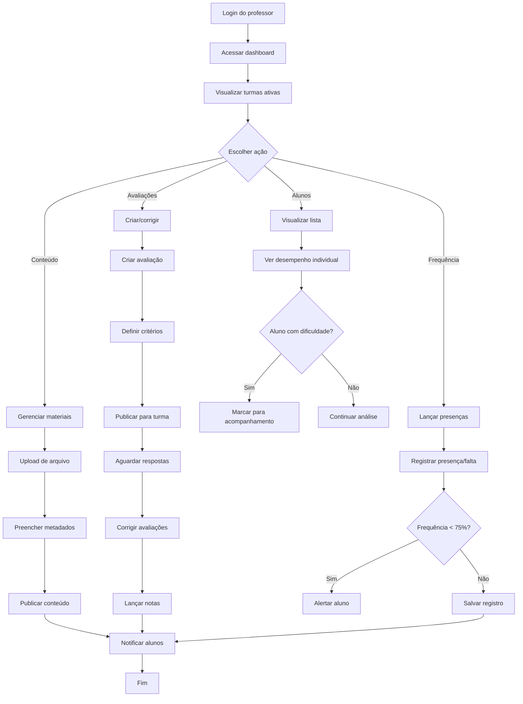
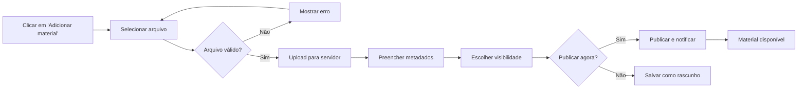
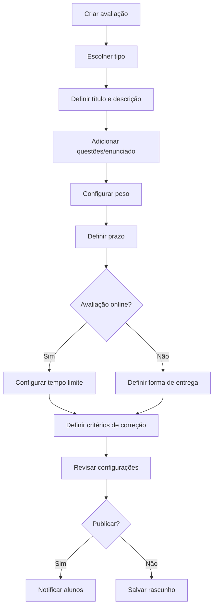
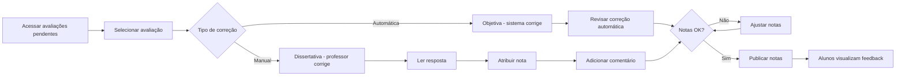
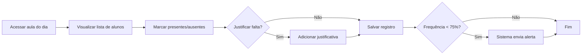
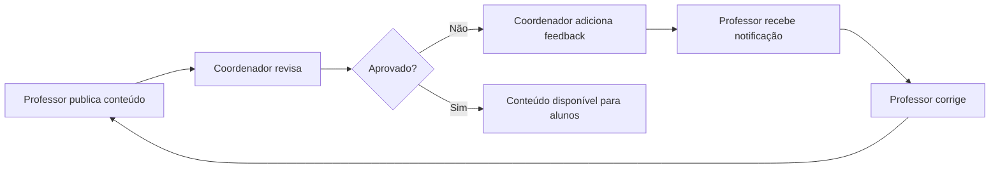
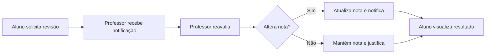

import { Meta } from '@storybook/blocks';

<Meta title="Jornadas/Professor/Gestão de Turma" />

# Jornada do Professor: Gestão de Turma

## Visão Geral

Esta jornada descreve como o professor gerencia suas turmas, desde o acesso inicial até o lançamento de notas e acompanhamento de alunos.

**Objetivo**: Professor conseguir gerenciar turma de forma autônoma e eficiente.

**Duração média**: 20 minutos por sessão

**Frequência**: Diária

---

## Fluxo Principal

---

## Etapas Detalhadas

### 1. Acesso ao Dashboard

**Objetivo**: Professor visualiza resumo de suas turmas.

**Informações exibidas**:
- Turmas ativas (filtradas por período atual)
- Próximas aulas (calendário)
- Atividades pendentes de correção
- Alertas (alunos com frequência baixa)
- Notificações do sistema

**Interações disponíveis**:
- Filtrar turmas por período/curso
- Acessar detalhes de uma turma
- Criar novo conteúdo
- Responder mensagens de alunos

**Tempo médio**: 1 minuto

---

### 2. Gerenciar Materiais Didáticos

**Objetivo**: Disponibilizar conteúdo para alunos.

**Fluxo de upload**:

**Metadados obrigatórios**:
- Título (RN-VAL-014)
- Descrição (RN-VAL-015)
- Tipo de material (aula, exercício, leitura complementar)
- Disciplina/módulo

**Metadados opcionais**:
- Data de liberação (agendamento)
- Data de validade
- Download permitido (sim/não)
- Material obrigatório (sim/não)

**Regras de negócio**:
- Tamanho máximo por arquivo: 50 MB (RN-VAL-013)
- Formatos permitidos conforme tipo
- Scan antivírus obrigatório
- Coordenador pode exigir aprovação prévia

**Pontos de fricção**:
- ⚠️ Upload lento para arquivos grandes
- ⚠️ Muitos metadados desanimam

**Melhorias aplicadas**:
- ✅ Barra de progresso de upload
- ✅ Preenchimento automático de metadados (AI sugere título/descrição)
- ✅ Templates de metadados salvos

**Tempo médio**: 5 minutos por material

---

### 3. Acompanhamento de Alunos

**Objetivo**: Identificar alunos com dificuldade.

**Dashboard de aluno individual**:
- Foto e dados básicos
- Frequência acumulada
- Média de notas
- Atividades pendentes
- Histórico de interações
- Gráfico de evolução

**Indicadores de alerta**:
- 🔴 Frequência < 70%
- 🔴 Média < 5.0
- 🟡 Frequência < 80%
- 🟡 Média < 7.0
- 🟢 Frequência ≥ 80% e Média ≥ 7.0

**Ações disponíveis**:
- Enviar mensagem individual
- Marcar para acompanhamento especial
- Solicitar intervenção da coordenação
- Agendar reunião

**Tempo médio**: 2 minutos por aluno

---

### 4. Criação de Avaliações

**Objetivo**: Criar instrumento de avaliação.

**Tipos de avaliação**:
- Prova objetiva (múltipla escolha)
- Prova dissertativa
- Trabalho para entrega
- Atividade prática
- Projeto

**Configurações**:

**Regras de negócio**:
- Peso da avaliação: 0.1 a 10.0
- Soma dos pesos deve ser 10.0 no final do curso
- Prazo deve ser no futuro
- Questões objetivas têm gabarito obrigatório

**Pontos de fricção**:
- ⚠️ Criar questões leva tempo
- ⚠️ Difícil garantir soma de pesos = 10.0

**Melhorias aplicadas**:
- ✅ Banco de questões reutilizáveis
- ✅ Calculadora automática de pesos
- ✅ Templates de avaliação

**Tempo médio**: 30 minutos (nova) / 10 minutos (reutilizando)

---

### 5. Correção e Lançamento de Notas

**Objetivo**: Avaliar desempenho dos alunos.

**Fluxo de correção**:

**Recursos de correção**:
- Grade de correção (rubrica)
- Comentários por questão
- Comentário geral
- Possibilidade de anexar áudio (feedback falado)

**Regras de negócio**:
- Nota deve estar entre 0.0 e 10.0 (RN-VAL-010)
- Nota publicada pode ser editada em até 7 dias
- Aluno é notificado quando nota é publicada
- Histórico de alterações é mantido

**Pontos de fricção**:
- ⚠️ Correção manual é demorada
- ⚠️ Difícil manter consistência entre correções

**Melhorias aplicadas**:
- ✅ AI sugere nota baseada em rubrica
- ✅ Templates de comentários comuns
- ✅ Atalhos de teclado para navegação

**Tempo médio**: 3 minutos por aluno (dissertativa) / 10 segundos (objetiva)

---

### 6. Controle de Frequência

**Objetivo**: Registrar presença dos alunos.

**Métodos de registro**:
- Manual (professor marca lista)
- QR Code (aluno escaneia na sala)
- Geolocalização (aluno confirma presença pelo app)
- Integração com sistema de catraca

**Fluxo manual**:

**Regras de negócio**:
- Frequência mínima: 75% (RN-VAL-011)
- Falta pode ser justificada (atestado, documentos)
- Professor não pode alterar frequência após 7 dias
- Sistema calcula frequência automaticamente

**Pontos de fricção**:
- ⚠️ Marcar lista manualmente é demorado
- ⚠️ Alunos podem burlar QR Code

**Melhorias aplicadas**:
- ✅ Botão "Marcar todos presentes" com exceções
- ✅ QR Code com tempo de expiração curto
- ✅ Geolocalização com raio de 50 metros

**Tempo médio**: 30 segundos (automático) / 3 minutos (manual para turma de 40)

---

## Fluxos Alternativos

### Fluxo A: Conteúdo Reprovado pela Coordenação

### Fluxo B: Aluno Contesta Nota

---

## Métricas e KPIs

| Métrica | Meta | Atual |
|---------|------|-------|
| Tempo médio de correção | ≤ 5 min/aluno | 4 min/aluno |
| Conteúdo publicado em até 24h | ≥ 90% | 87% |
| Alunos com feedback individualizado | ≥ 80% | 75% |
| Uso de ferramentas de acompanhamento | ≥ 70% | 68% |
| Satisfação do professor | ≥ 4.0/5.0 | 4.2/5.0 |

---

## Pontos de Melhoria Identificados

1. **Correção manual demorada** (4 min/aluno)
   - Ação: Implementar AI para sugestão de notas
   - Ação: Criar mais templates de feedback

2. **Baixo uso de acompanhamento individual** (68%)
   - Ação: Notificações proativas sobre alunos em risco
   - Ação: Simplificar dashboard de aluno

3. **Upload de conteúdo lento** (13% leva mais de 24h)
   - Ação: Permitir upload assíncrono (continua em background)
   - Ação: Aumentar limite de tamanho de arquivo

---

## Regras de Negócio Relacionadas

- [RN-PERM-001 a RN-PERM-004](../?path=/docs/regras-de-negócio-permissões--docs) - Permissões de professor
- [RN-VAL-010 a RN-VAL-012](../?path=/docs/regras-de-negócio-validações--docs) - Validações de notas e frequência
- [RN-VAL-013 a RN-VAL-015](../?path=/docs/regras-de-negócio-validações--docs) - Validações de conteúdo

---

## Referências

- **Componentes**: [Table](../?path=/docs/componentes-table--docs), [Input](../?path=/docs/componentes-input--docs), [Card](../?path=/docs/componentes-card--docs)
- **Casos de Uso**: [UC-010: Lançar Notas](../?path=/docs/casos-de-uso-avaliacao--docs), [UC-011: Registrar Frequência](../?path=/docs/casos-de-uso-avaliacao--docs)

---

**Última atualização**: 14 de janeiro de 2026  
**Responsável**: Equipe de Produto  
**Revisão**: Mensal
