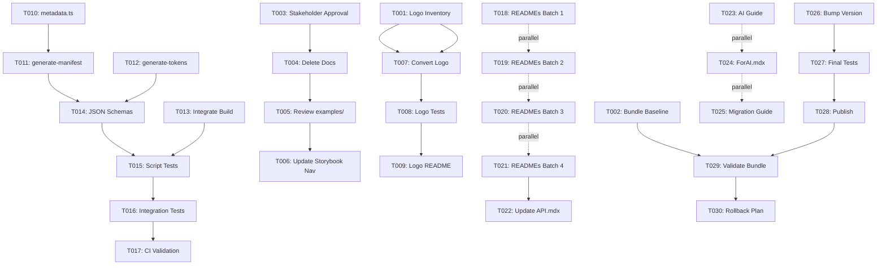

# Tasks: Design System v2.0 - Melhorias de Usabilidade e Correções

**Feature**: `001-ds-v2-melhorias`  
**Branch**: `001-ds-v2-melhorias`  
**Based on**: [plan.md](plan.md) | [GAPS-ANALYSIS.md](GAPS-ANALYSIS.md)

---

## 📊 Visão Geral

**Total de Fases**: 7 (Pre-Flight + 6 Sprints)  
**Estimativa**: 10-16 dias  
**Tarefas Totais**: 89 tarefas  
**Crítico**: Sprint -1 e Sprint 1 (Logo fix)

**Progresso**: 
- [ ] Sprint -1: Pre-Flight Check (3 tarefas)
- [ ] Sprint 0: Limpeza de Escopo (3 tarefas)
- [ ] Sprint 1: Critical Bug Fix (3 tarefas)
- [ ] Sprint 2: Infraestrutura de Metadata (7 tarefas)
- [ ] Sprint 3: Documentação Completa (5 tarefas, 28 sub-tarefas)
- [ ] Sprint 4: AI Readiness (3 tarefas)
- [ ] Sprint 5: Publicação e Validação (5 tarefas)

---

## Phase 1: Setup (Sprint -1)

### - [ ] T001 Localizar e Documentar Todos os Logos
**Descrição**: Inventário completo de variantes do logo Educacross  
**Arquivo**: `specs/001-ds-v2-melhorias/LOGO-INVENTORY.md`  
**Comandos**:
```bash
Get-ChildItem -Path packages/ui/src/assets/ -Filter "*logo*" -Recurse
Select-String -Path "packages/ui/src/assets/images/logo-educacross.svg" -Pattern "viewBox"
```

**Subtarefas**:
- [ ] Localizar `logo-educacross.svg`
- [ ] Verificar se existe `logo-educacross-white.svg`
- [ ] Anotar viewBox de cada SVG
- [ ] Verificar uso no Header
- [ ] Decidir qual(is) converter para inline

**Critério de Aceitação**: Documento com path, viewBox e decisão de conversão

---

### - [ ] T002 Medir Bundle Size Baseline
**Descrição**: Baseline do bundle atual antes de mudanças  
**Arquivo**: `specs/001-ds-v2-melhorias/BUNDLE-BASELINE.md`  
**Comandos**:
```bash
cd packages/ui
pnpm build
Get-Item dist/index.* | Select-Object Name, @{N='Size(KB)';E={[math]::Round($_.Length/1KB,2)}}
```

**Subtarefas**:
- [ ] Build packages/ui
- [ ] Medir index.js uncompressed
- [ ] Medir index.mjs uncompressed
- [ ] Estimar gzip (aproximadamente 30% do tamanho)
- [ ] Documentar em tabela

**Critério de Aceitação**: Baseline documentado com métricas atuais

---

### - [ ] T003 Obter Aprovações de Stakeholders
**Descrição**: Alignment com Tech Lead, Design, DevEx e Security  
**Arquivo**: Slack/Email threads

**Subtarefas**:
- [ ] Tech Lead: Revisar abordagem inline SVG e scripts AST
- [ ] Design: Validar fidelidade visual da conversão
- [ ] DevEx: Feedback sobre manifest.json schema
- [ ] Security: Verificar que inline SVG não introduz XSS

**Critério de Aceitação**: Aprovações documentadas, nenhum blocker

---

## Phase 2: Foundational (Sprint 0)

### - [ ] T004 Deletar Pastas de Documentação Não-DS
**Descrição**: Remover 19 arquivos fora do escopo de Design System  
**Diretórios**: `apps/storybook/stories/`

**Subtarefas**:
- [ ] Deletar `business-rules/` (4 arquivos)
- [ ] Deletar `journeys/` (3 arquivos)
- [ ] Deletar `use-cases/` (2 arquivos)
- [ ] Deletar `features/` (10 arquivos)

**Comandos**:
```bash
Remove-Item -Recurse apps/storybook/stories/business-rules/
Remove-Item -Recurse apps/storybook/stories/journeys/
Remove-Item -Recurse apps/storybook/stories/use-cases/
Remove-Item -Recurse apps/storybook/stories/features/
```

**Critério de Aceitação**: 19 arquivos removidos, Storybook rebuilda sem erros

---

### - [ ] T005 Revisar e Classificar Pasta examples/
**Descrição**: Aplicar regra objetiva para manter apenas composições puras de UI  
**Arquivo**: `specs/001-ds-v2-melhorias/EXAMPLES-REVIEW.md`

**Regra**: Import apenas de @educacross/ui → MANTER | Import de lógica de negócio → REMOVER

**Subtarefas**:
- [ ] Listar arquivos em `examples/`
- [ ] Para cada arquivo: analisar imports
- [ ] Classificar: PURE_UI ou BUSINESS_LOGIC
- [ ] Preencher tabela de decisão
- [ ] Remover arquivos classificados como BUSINESS_LOGIC

**Critério de Aceitação**: Tabela completa, apenas composições UI restam

---

### - [ ] T006 [P] Atualizar Navegação do Storybook
**Descrição**: Remover referências a pastas deletadas  
**Arquivo**: `.storybook/main.ts`

**Subtarefas**:
- [ ] Verificar stories configuradas em main.ts
- [ ] Remover referências a business-rules, journeys, etc
- [ ] Rebuild Storybook: `pnpm storybook`
- [ ] Validar navegação limpa

**Critério de Aceitação**: Storybook roda sem erros 404, navegação clara

---

## Phase 3: User Story 1 - Logo Fix (Sprint 1)

**Goal**: Corrigir bug crítico do componente Logo que não carrega via npm install

**Test Criteria**: Logo renderiza em projeto externo após instalação via npm

---

### - [ ] T007 Extrair SVG e Converter para TSX Component
**Descrição**: Converter logo de import svg para inline SVG component  
**Arquivo**: `packages/ui/src/components/Logo/Logo.tsx`

**Subtarefas**:
- [ ] Abrir arquivo SVG original
- [ ] Copiar conteúdo `<svg>...</svg>`
- [ ] Criar novo Logo.tsx com SVG inline
- [ ] Manter props: `size`, `className`, `...props`
- [ ] Adicionar `currentColor` para customização
- [ ] Adicionar `role="img"` e `aria-label="Educacross"`
- [ ] Testar localmente com `npm link`

**Código**:
```tsx
export const Logo = ({ size = "default", className, ...props }) => {
  const sizes = {
    sm: "h-5 w-auto",
    default: "h-7 w-auto", 
    lg: "h-9 w-auto"
  };
  
  return (
    <svg
      className={cn(sizes[size], className)}
      viewBox="0 0 [X] [Y]"
      fill="currentColor"
      xmlns="http://www.w3.org/2000/svg"
      role="img"
      aria-label="Educacross"
      {...props}
    >
      {/* SVG paths aqui */}
    </svg>
  );
};
```

**Critério de Aceitação**: API externa idêntica, SVG inline funciona

---

### - [ ] T008 [P] Criar Testes do Novo Logo
**Descrição**: Suite de testes para Logo inline  
**Arquivo**: `packages/ui/src/components/Logo/Logo.test.tsx`

**Subtarefas**:
- [ ] Test: renderiza sem erros
- [ ] Test: prop `size="sm"` aplica classe correta
- [ ] Test: prop `className` é mesclada
- [ ] Test: `role="img"` presente
- [ ] Test: `aria-label` presente
- [ ] Integration: Logo dentro de Header funciona

**Comandos**: `pnpm test Logo.test.tsx`

**Critério de Aceitação**: 100% coverage em Logo.tsx

---

### - [ ] T009 [P] Documentar Logo Component
**Descrição**: README completo para Logo  
**Arquivo**: `packages/ui/src/components/Logo/README.md`

**Estrutura**: Seguir template do plan.md (instalação, uso, props, exemplos)

**Subtarefas**:
- [ ] Seção: Instalação
- [ ] Seção: Uso básico com código
- [ ] Seção: Props table
- [ ] Seção: Exemplos (size variants)
- [ ] Seção: Acessibilidade
- [ ] Seção: Links (Storybook, source code)
- [ ] Atualizar story do Storybook

**Critério de Aceitação**: README completo, story atualizada

---

## Phase 4: User Story 2 - Metadata Infrastructure (Sprint 2)

**Goal**: Criar infraestrutura de discovery programático (manifest.json, metadata.ts, schemas)

**Test Criteria**: Scripts geram JSONs válidos, CI valida sincronização

---

### - [ ] T010 Implementar metadata.ts Exports
**Descrição**: Exports TypeScript para discovery  
**Arquivo**: `packages/ui/src/metadata.ts`

**Subtarefas**:
- [ ] Criar `componentList` (array de 28 componentes)
- [ ] Criar type `ComponentName`
- [ ] Criar `iconIndex` (feather + custom)
- [ ] Criar `metadata` object
- [ ] Exportar em `src/index.ts`

**Código**:
```typescript
export const componentList = [
  'Accordion', 'Alert', 'Avatar', ...
] as const;

export type ComponentName = typeof componentList[number];

export const iconIndex = {
  feather: { names: iconNames, categories, count },
  custom: { names: customIconNames, categories, count }
};

export const metadata = {
  name: '@fabioeducacross/ui',
  version: '0.2.0',
  components: componentList,
  icons: iconIndex,
  ...
};
```

**Critério de Aceitação**: Exports disponíveis após build

---

### - [ ] T011 Criar Script generate-manifest.ts
**Descrição**: Geração automática de manifest.json via AST parsing  
**Arquivo**: `packages/ui/scripts/generate-manifest.ts`

**Subtarefas**:
- [ ] Instalar `typescript` e `@typescript-eslint/parser`
- [ ] Ler `src/components/` via fs
- [ ] Para cada componente: parsear .tsx com AST
- [ ] Extrair interface Props
- [ ] Extrair JSDoc
- [ ] Extrair variants CVA
- [ ] Gerar objeto JSON
- [ ] Validar contra schema (Task T014)
- [ ] Escrever `dist/manifest.json`

**Fallback**: Se AST parser falhar, commit manifest manual

**Critério de Aceitação**: `pnpm generate:manifest` cria JSON válido

---

### - [ ] T012 [P] Criar Script generate-tokens.ts
**Descrição**: Extração de design tokens de styles.css  
**Arquivo**: `packages/ui/scripts/generate-tokens.ts`

**Subtarefas**:
- [ ] Parsear `src/styles.css`
- [ ] Extrair CSS variables (--primary, --spacing-xs, etc)
- [ ] Converter HSL → Hex (biblioteca `color-convert`)
- [ ] Agrupar por categoria (colors, spacing, typography)
- [ ] Gerar `dist/tokens.json`

**Critério de Aceitação**: tokens.json com 50+ tokens

---

### - [ ] T013 [P] Integrar Scripts no Build
**Descrição**: Executar scripts automaticamente no pnpm build  
**Arquivo**: `packages/ui/package.json`

**Mudança**:
```json
"scripts": {
  "build": "pnpm generate:manifest && pnpm generate:tokens && tsup",
  "generate:manifest": "tsx scripts/generate-manifest.ts",
  "generate:tokens": "tsx scripts/generate-tokens.ts"
}
```

**Critério de Aceitação**: `pnpm build` gera manifest.json e tokens.json

---

### - [ ] T014 Criar JSON Schemas
**Descrição**: Schemas para validação de manifest.json e tokens.json  
**Arquivos**: `packages/ui/schemas/*.schema.json`

**Subtarefas**:
- [ ] Criar `manifest.schema.json` (define estrutura esperada)
- [ ] Criar `tokens.schema.json`
- [ ] Instalar `ajv` para validação
- [ ] Adicionar validation nos scripts
- [ ] Copiar schemas para dist/ no build
- [ ] (Opcional) Publicar em GitHub Pages

**Critério de Aceitação**: Scripts falham se JSON inválido

---

### - [ ] T015 [P] Criar Testes dos Scripts
**Descrição**: Unit tests para generate-manifest e generate-tokens  
**Arquivo**: `packages/ui/scripts/__tests__/`

**Subtarefas**:
- [ ] Test generate-manifest: gera todos 28 componentes
- [ ] Test generate-manifest: detecta props obrigatórias
- [ ] Test generate-manifest: graceful failure
- [ ] Test generate-tokens: extrai CSS variables
- [ ] Test generate-tokens: converte HSL → Hex
- [ ] Test generate-tokens: agrupa por categoria

**Comando**: `pnpm test:scripts`

**Critério de Aceitação**: Todos testes passam

---

### - [ ] T016 [P] Criar Testes de Integração
**Descrição**: Validar manifest.json contra tipos TS e componentList  
**Arquivo**: `packages/ui/src/__tests__/manifest.test.ts`

**Subtarefas**:
- [ ] Test: manifest contém todos de componentList
- [ ] Test: cada componente tem props válidas
- [ ] Test: categories são válidas (form|layout|feedback|data)
- [ ] Script E2E: instalar pacote em projeto teste
- [ ] Script E2E: importar Logo e renderizar
- [ ] Script E2E: importar metadata e validar

**Critério de Aceitação**: E2E passa sem erros

---

### - [ ] T017 Adicionar Validação ao CI
**Descrição**: GitHub Actions step para validar docs sincronizadas  
**Arquivo**: `packages/ui/scripts/validate-docs.ts` + `.github/workflows/`

**Subtarefas**:
- [ ] Script: verificar README existe para cada componente
- [ ] Script: verificar manifest.json tem todos componentes
- [ ] Adicionar step ao workflow CI
- [ ] Testar localmente com act ou similar

**Critério de Aceitação**: CI quebra se manifest desatualizado

---

## Phase 5: User Story 3 - Component Documentation (Sprint 3)

**Goal**: 28 componentes com README individual + API Reference completa

**Test Criteria**: Cada componente tem README seguindo template, API.mdx lista todos

---

### - [ ] T018 [P] Criar READMEs Batch 1: Forms (6 componentes)
**Descrição**: Documentação de componentes de formulário  
**Arquivos**: `packages/ui/src/components/*/README.md`

**Componentes**:
- [ ] Button/README.md (expandir existente)
- [ ] Input/README.md
- [ ] Label/README.md
- [ ] Checkbox/README.md
- [ ] Radio/README.md
- [ ] Select/README.md

**Template**: Seguir estrutura do plan.md (instalação, uso, props, variantes, a11y, exemplos, links)

**Critério de Aceitação**: 6 READMEs completos

---

### - [ ] T019 [P] Criar READMEs Batch 2: Layout (5 componentes)
**Descrição**: Documentação de componentes de layout  

**Componentes**:
- [ ] Header/README.md
- [ ] Sidebar/README.md (expandir existente)
- [ ] Card/README.md
- [ ] Accordion/README.md
- [ ] Tabs/README.md

**Critério de Aceitação**: 5 READMEs completos

---

### - [ ] T020 [P] Criar READMEs Batch 3: Feedback (5 componentes)
**Descrição**: Documentação de componentes de feedback  

**Componentes**:
- [ ] Alert/README.md
- [ ] Dialog/README.md
- [ ] Toast/README.md
- [ ] Tooltip/README.md
- [ ] Popover/README.md

**Critério de Aceitação**: 5 READMEs completos

---

### - [ ] T021 [P] Criar READMEs Batch 4: Data & Misc (12 componentes)
**Descrição**: Documentação dos componentes restantes  

**Componentes**:
- [ ] Table/README.md
- [ ] Pagination/README.md
- [ ] Badge/README.md
- [ ] Avatar/README.md
- [ ] AvatarIcon/README.md
- [ ] Skeleton/README.md
- [ ] Logo/README.md (já feito em T009)
- [ ] Icon/README.md
- [ ] CustomIcon/README.md
- [ ] ThemeSwitcher/README.md
- [ ] DropdownMenu/README.md

**Critério de Aceitação**: 11 READMEs novos (Logo já existe)

---

### - [ ] T022 Atualizar API Reference no Storybook
**Descrição**: Completar API.mdx com 28 componentes  
**Arquivo**: `apps/storybook/stories/getting-started/API.mdx`

**Subtarefas**:
- [ ] Adicionar 13 componentes faltantes
- [ ] Para cada: props table, variantes, exemplos
- [ ] Validar props tables contra manifest.json
- [ ] Adicionar links para READMEs individuais

**Critério de Aceitação**: API.mdx documenta 28/28 componentes

---

## Phase 6: User Story 4 - AI Readiness (Sprint 4)

**Goal**: Documentação específica para agentes de IA

**Test Criteria**: IA consegue descobrir componentes/ícones e gerar código válido

---

### - [ ] T023 Criar AI Agent Guide
**Descrição**: Guia otimizado para LLMs  
**Arquivo**: `packages/ui/docs/AI-GUIDE.md`

**Seções**:
- [ ] Quick Reference (discovery programático)
- [ ] Manifest JSON usage
- [ ] Composition Patterns (não business logic)
- [ ] Token Usage
- [ ] Common Mistakes
- [ ] Validation Rules

**Critério de Aceitação**: Guia completo com exemplos executáveis

---

### - [ ] T024 [P] Criar ForAI.mdx no Storybook
**Descrição**: Story específica para agentes IA  
**Arquivo**: `apps/storybook/stories/getting-started/ForAI.mdx`

**Subtarefas**:
- [ ] Link para AI-GUIDE.md
- [ ] Exemplos de parsing do manifest.json
- [ ] Code snippets para discovery
- [ ] Validação antes de gerar código

**Critério de Aceitação**: ForAI.mdx navegável no Storybook

---

### - [ ] T025 [P] Criar Migration Guide
**Descrição**: Guia de migração v0.1.x → v0.2.0  
**Arquivo**: `packages/ui/docs/MIGRATION-v2.md`

**Seções**:
- [ ] TL;DR: Zero breaking changes
- [ ] Novos features (Logo fix, metadata, manifest)
- [ ] Bugs corrigidos
- [ ] FAQ

**Critério de Aceitação**: Desenvolvedores sabem que não precisam mudar código

---

## Phase 7: Final - Publicação (Sprint 5)

**Goal**: Publicar v0.2.0, validar e preparar rollback

**Test Criteria**: Pacote instalável, Logo funciona, tree-shaking validado

---

### - [ ] T026 Bump Version para 0.2.0
**Descrição**: Atualizar versão em todos lugares  
**Arquivos**: `package.json`, `metadata.ts`, `manifest.json`

**Subtarefas**:
- [ ] `packages/ui/package.json`: version = "0.2.0"
- [ ] `packages/ui/src/metadata.ts`: version = "0.2.0"
- [ ] Gerar manifest.json com versão correta
- [ ] Commit: "chore: bump version to 0.2.0"
- [ ] Criar tag: `git tag v0.2.0`

**Critério de Aceitação**: Versão consistente em todos arquivos

---

### - [ ] T027 Build e Testes Finais
**Descrição**: Validação completa antes de publicar  

**Subtarefas**:
- [ ] `pnpm build` gera manifest.json e tokens.json
- [ ] `pnpm test` passa 100%
- [ ] `pnpm lint` sem erros
- [ ] `pnpm typecheck` sem erros
- [ ] Coverage >80% em components

**Critério de Aceitação**: Todos checks passam

---

### - [ ] T028 Publicar no GitHub Packages
**Descrição**: npm publish para @fabioeducacross/ui@0.2.0  

**Comandos**:
```bash
cd packages/ui
npm publish
git push origin master --tags
```

**Subtarefas**:
- [ ] Verificar NPM_TOKEN configurado
- [ ] Publicar: `npm publish`
- [ ] Push tag: `git push origin v0.2.0`
- [ ] Verificar pacote aparece em GitHub Packages

**Critério de Aceitação**: v0.2.0 disponível publicamente

---

### - [ ] T029 Validação Externa e Tree-Shaking
**Descrição**: Testes em projeto externo  
**Diretório**: `/tmp/test-ds-v020/`

**Subtarefas**:
- [ ] Criar projeto teste: `npm init -y`
- [ ] Instalar: `npm install @fabioeducacross/ui@0.2.0`
- [ ] Test 1: Logo renderiza
- [ ] Test 2: `import { metadata }` funciona
- [ ] Test 3: manifest.json acessível
- [ ] Test 4: Tree-shaking
  - Criar app com apenas Button
  - Build com vite
  - Verificar bundle < 50KB
  - Confirmar que Dialog/Table não estão no bundle

**Critério de Aceitação**: Todos testes passam, tree-shaking funciona

---

### - [ ] T030 Preparar Rollback Plan
**Descrição**: Documentar estratégia de rollback  
**Arquivo**: `packages/ui/ROLLBACK.md`

**Subtarefas**:
- [ ] Criar branch `hotfix/revert-logo-inline` (sem merge)
- [ ] Documentar comandos de unpublish
- [ ] Documentar comandos de revert tag
- [ ] Documentar processo de hotfix v0.1.2
- [ ] Template de comunicação de rollback

**Comandos**:
```bash
# Se necessário reverter
npm unpublish @fabioeducacross/ui@0.2.0 --force
git push origin :refs/tags/v0.2.0
git checkout hotfix/revert-logo-inline
npm version patch && npm publish
```

**Critério de Aceitação**: Rollback executável em < 15 minutos

---

## Dependency Graph



**Legenda**:
- Linha sólida (→): Dependência bloqueante
- Linha tracejada (-.->): Pode executar em paralelo
- [P]: Task paralelizável

---

## Parallel Execution Opportunities

### Sprint -1 (Tasks 1-3)
**Sequential**: T001 → T002 → T003 (cada bloqueia a próxima)

### Sprint 0 (Tasks 4-6)
**Sequential**: T004 → T005 → T006

### Sprint 1 (Tasks 7-9)
- **T007** (sequential, bloqueia os outros)
- **T008 + T009** (paralelo após T007)

### Sprint 2 (Tasks 10-17)
- **T010** (primeiro, base para os outros)
- **T011 + T012 + T013** (paralelo após T010)
- **T014** (depende de T011, T012)
- **T015 + T016 + T017** (paralelo após T014)

### Sprint 3 (Tasks 18-22)
- **T018 + T019 + T020 + T021** (TOTALMENTE PARALELO - 4 devs)
- **T022** (após todos READMEs)

### Sprint 4 (Tasks 23-25)
- **T023 + T024 + T025** (TOTALMENTE PARALELO)

### Sprint 5 (Tasks 26-30)
**Sequential**: T026 → T027 → T028 → T029 → T030

---

## Success Metrics Tracking

| Métrica | Target | Status |
|---------|--------|--------|
| Logo funciona externally | 100% | ⏳ T029 |
| READMEs completos | 28/28 | ⏳ T018-T021 |
| manifest.json completo | 28/28 components | ⏳ T011 |
| tokens.json completo | 50+ tokens | ⏳ T012 |
| Line coverage | >80% src/components/ | ⏳ T027 |
| Branch coverage | >70% críticos | ⏳ T027 |
| Bundle size gzip | <150KB | ⏳ T029 |
| Tree-shaking | Button < 50KB | ⏳ T029 |

---

## Risk Mitigation per Task

| Task | Risk | Mitigation |
|------|------|------------|
| T001 | Logo não encontrado | Buscar em todo repo, perguntar ao Design |
| T007 | Conversão quebra visual | T003 approval do Design primeiro |
| T011 | AST parser falha | Fallback: commit manifest manual |
| T018-T021 | READMEs incompletos | Template + CI validation (T017) |
| T028 | Publish falha | Verificar NPM_TOKEN, dry-run primeiro |
| T029 | Tree-shaking não funciona | Investigar tsup config, adicionar splitting |

---

## Implementation Strategy

### MVP (Minimum Viable v0.2.0)
**Scope**: Sprints -1, 0, 1 apenas (Logo fix)
**Timeline**: 2-3 dias
**Release**: v0.1.2 (hotfix)

### Full v0.2.0
**Scope**: Todos sprints
**Timeline**: 10-16 dias
**Release**: v0.2.0 (feature release)

### Incremental Delivery
- **Week 1**: Sprints -1, 0, 1 → v0.1.2
- **Week 2**: Sprints 2, 3 → v0.2.0-beta.1
- **Week 3**: Sprints 4, 5 → v0.2.0 stable

---

## Next Steps

1. **Aprovação**: Revisar tasks.md com stakeholders
2. **Início**: Executar T001 (logo inventory) imediatamente
3. **Tracking**: Atualizar checkboxes conforme progresso
4. **Comunicação**: Slack update após cada sprint completo

**Branch Strategy**: `001-ds-v2-melhorias` → PR para `master` após Sprint 5
